# PRD：退费记录增加项目/内容字段 + 账户退费功能

| 版本 | 日期 | 作者 | 变更说明 |
|------|------|------|---------|
| v1.0 | 2026-07-07 | Hermes Agent | 初版完整方案 |

---

## 一、背景与目标

### 1.1 当前系统现状

**refund_records 表**字段：
```
id, order_id, student_id, campus, course_name, total_lessons, total_amount,
consumed_lessons, consumed_amount, remaining_lessons, remaining_amount,
custom_deduction, actual_refund, bank_name, bank_account, account_holder,
refund_reason, status, approval_stage, reject_reason,
approver1, approver2, approver3, created_at, updated_at
```

**当前退费流程（仅课程退费）**：
1. 学员详情页 → 课程列表中点击「退费」按钮 → 打开退费申请弹窗
2. 自动计算剩余课时/金额、自定义扣减、实退金额
3. 填写银行收款信息 + 退费原因
4. 提交 → `submit_refund` API（`index.php:3432`）
5. 三级审批：一级审批 → 二级审批 → 财务确认（`approve_refund` API, `index.php:3555`）
6. 财务确认时支持 `cash`（银行卡退）和 `balance`（退回余额）两种模式

**学员账户系统**（`student_accounts` + `account_transactions`）：
- 学员有余额、累计充值、累计消费、累计退款
- 支持充值（`top_up_account`）、报名时使用余额（`use_balance`）
- 账户有完整交易流水记录

**核心痛点**：
- 工作记录-退费记录列表中无法区分「课程退费」还是「账户退费」
- 学员账户余额无法直接发起退款——只能通过课程退费后再退回余额
- 如果学员充了钱但没有买课，想退款时没有入口

### 1.2 用户需求

| 编号 | 需求 | 优先级 |
|------|------|--------|
| R1 | 工作记录-退费记录表格新增「项目」列（课程/账户） | P0 |
| R2 | 工作记录-退费记录表格新增「内容」列（课程名称 或 "账户退费"） | P0 |
| R3 | 学员账户余额支持发起退费，退到银行卡 | P0 |
| R4 | 账户退费走与课程退费相同的三级审批流程 | P0 |
| R5 | 账户退费审批完成后从余额扣除并生成退款流水 | P0 |

---

## 二、数据库变更方案

### 2.1 refund_records 表新增字段

```sql
-- 新增「项目」字段：课程 / 账户
ALTER TABLE refund_records ADD COLUMN project VARCHAR(20) DEFAULT '课程' COMMENT '退费项目类型：课程/账户';

-- 新增「内容」字段：课程名或"账户退费"
ALTER TABLE refund_records ADD COLUMN content VARCHAR(500) DEFAULT '' COMMENT '退费内容：课程名称或账户退费固定文案';
```

**字段说明**：

| 字段 | 类型 | 默认值 | 说明 |
|------|------|--------|------|
| `project` | VARCHAR(20) | `'课程'` | 枚举：`课程` / `账户` |
| `content` | VARCHAR(500) | `''` | 课程类=课程名；账户类=固定"账户退费" |

**兼容性**：
- 为已有历史数据设置默认值：`project='课程'`, `content=course_name`
- 一行 SQL 迁移脚本：
```sql
ALTER TABLE refund_records ADD COLUMN project VARCHAR(20) DEFAULT '课程' AFTER id;
ALTER TABLE refund_records ADD COLUMN content VARCHAR(500) DEFAULT '' AFTER project;
-- 历史数据回填
UPDATE refund_records SET content = course_name WHERE project = '课程';
```

**索引建议**：可为 `project` 添加普通索引以支持按类型筛选。
```sql
ALTER TABLE refund_records ADD INDEX idx_project (project);
```

### 2.2 无需修改的表

| 表 | 说明 |
|----|------|
| `student_accounts` | 不需要变更，`total_refund` 字段已有，退费时扣减 `balance` |
| `account_transactions` | 不需要变更，已有 `type='refund'` 类型，`ref_type='refund'` |
| `orders` | 不需要变更（账户退费不创建 order） |

---

## 三、API 设计方案

### 3.1 修改现有 API

#### 3.1.1 `submit_refund`（`index.php:3432`）— 支持账户退费

**当前逻辑**：只处理 course order → refund_records。

**改造点**：新增参数 `refund_type`，区分两种模式。

```php
case 'submit_refund':
    $refundType = trim($input['refund_type'] ?? 'course'); // 'course' | 'account'
    
    if ($refundType === 'course') {
        // === 现有课程退费逻辑（不变） ===
        $orderId = intval($input['order_id'] ?? 0);
        // ... 原有逻辑 ...
        // INSERT 时增加 project + content 字段：
        // project='课程', content=课程名称
        $db->exec("INSERT INTO refund_records (
            project, content, order_id, student_id, campus, course_name, ...
        ) VALUES (
            '课程', " . $db->quote($order['course_name'] ?? '') . ", $orderId, ...
        )");
        
    } elseif ($refundType === 'account') {
        // === 新增：账户退费 ===
        $studentId = intval($input['student_id'] ?? 0);
        if ($studentId <= 0) { json(['error' => '学员ID无效']); break; }
        
        // 查询学员账户余额
        $acct = $db->prepare("SELECT balance FROM student_accounts WHERE student_id=:sid FOR UPDATE");
        $acct->bindValue(':sid', $studentId, PDO::PARAM_INT);
        $acct->execute();
        $acctRow = $acct->fetch(PDO::FETCH_ASSOC);
        $currentBalance = $acctRow ? floatval($acctRow['balance']) : 0.00;
        
        if ($currentBalance <= 0) { json(['error' => '账户余额为0，无法发起退费']); break; }
        
        // 退费金额 = 用户申请金额（不能超过余额）
        $refundAmount = floatval($input['refund_amount'] ?? 0);
        if ($refundAmount <= 0) { json(['error' => '退费金额必须大于0']); break; }
        if ($refundAmount > $currentBalance) {
            json(['error' => '退费金额不能超过账户余额（当前余额：' . number_format($currentBalance, 2) . '）']);
            break;
        }
        
        $bankName = trim($input['bank_name'] ?? '');
        $bankAccount = trim($input['bank_account'] ?? '');
        $accountHolder = trim($input['account_holder'] ?? '');
        $refundReason = trim($input['refund_reason'] ?? '');
        
        // 查询学员所在校区（取最近一条订单的校区，或学员默认校区）
        $campus = '';
        $orderCampus = $db->query("SELECT campus FROM orders WHERE student_id=$studentId ORDER BY id DESC LIMIT 1")->fetch(PDO::FETCH_ASSOC);
        if ($orderCampus) $campus = $orderCampus['campus'] ?? '';
        
        $n = now();
        $db->exec("INSERT INTO refund_records (
            project, content, order_id, student_id, campus,
            course_name, total_lessons, total_amount,
            consumed_lessons, consumed_amount,
            remaining_lessons, remaining_amount,
            custom_deduction, actual_refund,
            bank_name, bank_account, account_holder,
            refund_reason, status, approval_stage, created_at, updated_at
        ) VALUES (
            '账户', '账户退费', 0, $studentId, " . $db->quote($campus) . ",
            '账户退费', 0, 0,
            0, 0,
            0, 0,
            0, $refundAmount,
            " . $db->quote($bankName) . ", " . $db->quote($bankAccount) . ", " . $db->quote($accountHolder) . ",
            " . $db->quote($refundReason) . ", '待审批', '一级审批', '$n', '$n'
        )");
        
        // 冻结余额（扣减balance，记录到frozen_refund字段或直接扣减）
        // 方案A：立即扣减余额（推荐，简单直接）
        $upd = $db->prepare("UPDATE student_accounts SET balance=balance-:amt, total_refund=total_refund+:amt2 WHERE student_id=:sid");
        $upd->bindValue(':amt', $refundAmount);
        $upd->bindValue(':amt2', $refundAmount);
        $upd->bindValue(':sid', $studentId, PDO::PARAM_INT);
        $upd->execute();
        
        $newBalance = round($currentBalance - $refundAmount, 2);
        
        // 写流水：提现冻结
        $stmt2 = $db->prepare("INSERT INTO account_transactions (student_id, type, amount, balance_after, ref_type, ref_id, campus, note) VALUES (:sid, 'refund', :amt, :ba, 'refund_account', :rid, :campus, :note)");
        $stmt2->bindValue(':sid', $studentId, PDO::PARAM_INT);
        $stmt2->bindValue(':amt', $refundAmount);
        $stmt2->bindValue(':ba', $newBalance);
        $stmt2->bindValue(':rid', intval($db->query("SELECT LAST_INSERT_ID()")->fetchColumn()), PDO::PARAM_INT);
        $stmt2->bindValue(':campus', $campus, PDO::PARAM_STR);
        $stmt2->bindValue(':note', '账户退费申请-提现冻结', PDO::PARAM_STR);
        $stmt2->execute();
        
        $newId = $db->query("SELECT LAST_INSERT_ID()")->fetchColumn();
        json(['message' => '账户退费申请提交成功', 'id' => intval($newId)]);
    }
    break;
```

#### 3.1.2 `list_refund_records`（`index.php:3484`）— 返回新增字段

**当前 SQL**：`SELECT rr.*, s.name AS student_name, s.phone AS student_phone, o.order_no`

**改造**：无需改 SQL（`rr.*` 已包含新增的 `project` 和 `content` 字段）。前端表格新增两列即可。

> 可选优化：增加 `project` 参数筛选支持：
```php
$project = trim($_GET['project'] ?? '');
if ($project) {
    $where[] = "rr.project = :pj";
    $params[':pj'] = $project;
}
```

#### 3.1.3 `approve_refund`（`index.php:3555`）— 支持账户退费审批

**改造点**：财务确认阶段需要区分课程退费 vs 账户退费。

```php
// 在财务确认阶段 (approval_stage === '财务确认')
// 现有逻辑分支:
//   refundTo === 'balance' → 退回到余额 (仅课程退费可用)
//   else → 银行卡退费 (默认)

// 改造：
$project = $rr['project'] ?? '课程';

if ($project === '账户') {
    // 账户退费：只能退到银行卡，余额已在申请时扣减
    // 审批通过 → 更新状态为「已退费」+ 写流水
    $db->exec("UPDATE refund_records SET status='已退费', approver3=" . $db->quote($approver) . ", updated_at='$n' WHERE id=$id");
    
    // 更新之前冻结的流水备注
    $db->exec("UPDATE account_transactions SET note='账户退费-已退至银行卡' WHERE ref_type='refund_account' AND ref_id=$id");
    
    json(['message' => '财务确认通过，账户退费已完成（退至银行卡）']);
} else {
    // 课程退费：保持现有逻辑不变
    // ...
}
```

> **注意**：账户退费不提供 `refund_to=balance` 选项（余额已扣减，再退回余额无意义），退费 radio 在审批弹窗中只显示「退到银行卡」。

#### 3.1.4 `cancel_refund`（`index.php:3640`）— 支持账户退费撤销

**改造点**：撤销账户退费时，需恢复已扣减的余额。

```php
$rr = $db->query("SELECT * FROM refund_records WHERE id=$id")->fetch(PDO::FETCH_ASSOC);
$project = $rr['project'] ?? '课程';

if ($project === '账户') {
    // 恢复余额
    $refundAmount = floatval($rr['actual_refund'] ?? 0);
    $studentId = intval($rr['student_id']);
    
    // 恢复余额 + 冲正refund总额
    $db->exec("UPDATE student_accounts SET 
        balance = balance + $refundAmount, 
        total_refund = total_refund - $refundAmount 
        WHERE student_id = $studentId");
    
    // 写恢复流水
    $acct = $db->query("SELECT balance FROM student_accounts WHERE student_id=$studentId")->fetch(PDO::FETCH_ASSOC);
    $stmt = $db->prepare("INSERT INTO account_transactions (student_id, type, amount, balance_after, ref_type, ref_id, note) VALUES (:sid, 'deposit', :amt, :ba, 'refund_cancel', :rid, :note)");
    $stmt->bindValue(':sid', $studentId, PDO::PARAM_INT);
    $stmt->bindValue(':amt', $refundAmount);
    $stmt->bindValue(':ba', $acct['balance']);
    $stmt->bindValue(':rid', $id, PDO::PARAM_INT);
    $stmt->bindValue(':note', '账户退费撤销-余额恢复', PDO::PARAM_STR);
    $stmt->execute();
    
    // 标记原冻结流水的备注
    $db->exec("UPDATE account_transactions SET note='账户退费-已撤销' WHERE ref_type='refund_account' AND ref_id=$id");
} else {
    // 课程退费：现有逻辑（恢复 order 状态）
    $db->exec("UPDATE orders SET refund_status='正常' WHERE id=" . intval($rr['order_id']));
}

// 通用：删除退费记录
$db->exec("DELETE FROM refund_records WHERE id=$id");
json(['message' => '退费申请已撤销']);
```

### 3.2 新增 API（可选：查询账户余额）

已有 `get_student_account` API 可用，无需新增。

### 3.3 API 汇总

| Action | 变更类型 | 说明 |
|--------|---------|------|
| `submit_refund` | **修改** | 新增 `refund_type=account` 分支，支持账户退费申请；课程分支 INSERT 增加 project/content |
| `list_refund_records` | **修改**（小） | 可选增加 `project` 筛选参数 |
| `approve_refund` | **修改** | 财务确认时增加账户退费分支（银行卡仅作记录，不退到余额） |
| `cancel_refund` | **修改** | 增加账户退费撤销的余额恢复逻辑 |
| `get_refund_record` | 不变 | `rr.*` 已包含新字段 |

---

## 四、前端交互方案

### 4.1 工作记录-退费记录表格（`index.php:6603`）

#### 4.1.1 表格列调整

**当前表头**（13 列）：
```
订单号 | 学员 | 课程 | 校区 | 报读课时 | 消耗课时 | 剩余课时 | 报读金额 | 实退金额 | 扣减金额 | 状态 | 申请时间 | 操作
```

**新表头**（15 列，新增「项目」和「内容」）：
```
订单号 | 学员 | 项目 | 内容 | 校区 | 报读课时 | 消耗课时 | 剩余课时 | 报读金额 | 实退金额 | 扣减金额 | 状态 | 申请时间 | 操作
```

#### 4.1.2 HTML 修改（`index.php:6603-6605`）

```html
<table id="table-refund-records">
    <thead><tr>
        <th width="80">订单号</th>
        <th>学员</th>
        <th width="60">项目</th>
        <th>内容</th>
        <th>校区</th>
        <th>报读课时</th>
        <th>消耗课时</th>
        <th>剩余课时</th>
        <th>报读金额</th>
        <th>实退金额</th>
        <th>扣减金额</th>
        <th width="80">状态</th>
        <th width="120">申请时间</th>
        <th width="100">操作</th>
    </tr></thead>
```

同时更新 `colspan`：
- 空态占位从 `colspan="13"` → `colspan="15"`
- 错误占位同样调整

#### 4.1.3 JS 渲染修改（`main.js:7730-7746`）

```javascript
function renderRefundRecordTable(rows) {
    // ...
    const project = r.project || '课程';
    let projectBadge = '';
    if (project === '账户') {
        projectBadge = '<span style="display:inline-block;padding:2px 8px;background:#fef3c7;color:#d97706;border-radius:10px;font-size:12px;">账户</span>';
    } else {
        projectBadge = '<span style="display:inline-block;padding:2px 8px;background:#e0e7ff;color:#4f46e5;border-radius:10px;font-size:12px;">课程</span>';
    }
    
    return `<tr>
        <td style="font-family:monospace;font-size:12px;">${esc(r.order_no || '-')}</td>
        <td>${esc(r.student_name || '')}</td>
        <td>${projectBadge}</td>
        <td>${esc(r.content || r.course_name || '')}</td>
        <td>${esc(r.campus || '')}</td>
        <td>${ttl || '-'}</td>         <!-- 账户退费为0，显示- -->
        <td>${cl || '-'}</td>
        <td>${rl || '-'}</td>
        <td>${r.total_amount > 0 ? '¥'+ta.toFixed(2) : '-'}</td>
        <td style="font-weight:bold;color:#e74c3c;">¥${ar.toFixed(2)}</td>
        <td>¥${da.toFixed(2)}</td>
        <td style="white-space:nowrap;">${statusHtml}</td>
        <td>${created}</td>
        <td>${optHtml}</td>
    </tr>`;
}
```

#### 4.1.4 顶部筛选栏增加「项目」下拉

```html
<label style="font-size:13px;white-space:nowrap;">项目：</label>
<select id="filter-refund-project" onchange="loadRefundRecords()" style="padding:6px 10px;border:1px solid #ddd;border-radius:6px;font-size:13px;">
    <option value="">全部</option>
    <option value="课程">课程退费</option>
    <option value="账户">账户退费</option>
</select>
```

### 4.2 学员详情页-账户标签页（新增退费入口）

#### 4.2.1 交互位置

在 `index.php:6353` 充值按钮旁边增加「申请退费」按钮：

```html
<!-- index.php:6353 附近 -->
<button class="btn btn-primary btn-sm" onclick="showRechargeModal()" style="margin-top:4px;align-self:flex-start;">+ 充值</button>
<button class="btn btn-outline btn-sm" id="btn-account-refund" 
    onclick="showAccountRefundModal()" 
    style="margin-top:4px;align-self:flex-start;margin-left:8px;color:#e74c3c;border-color:#e74c3c;">
    申请退费
</button>
```

**按钮显示逻辑**：
- 余额 > 0 时显示且可点击
- 余额 = 0 时灰色禁用，title="账户余额为0，无法申请退费"

在 `loadStudentAccount()` 中更新按钮状态：
```javascript
const btn = document.getElementById('btn-account-refund');
if (btn) {
    const bal = Number(data.balance || 0);
    btn.disabled = (bal <= 0);
    btn.title = bal <= 0 ? '账户余额为0，无法申请退费' : '申请将余额退至银行卡';
    btn.style.opacity = bal <= 0 ? '0.5' : '1';
}
```

#### 4.2.2 账户退费申请弹窗 HTML

新增弹窗 `modal-account-refund`（放在 `index.php` 的 `modal-refund-apply` 附近）：

```html
<!-- 账户退费申请弹窗 -->
<div class="modal-overlay" id="modal-account-refund">
    <div class="modal modal-lg">
        <div class="modal-header">
            <h4>账户退费申请</h4>
            <button class="modal-close" onclick="closeModal('modal-account-refund')">&times;</button>
        </div>
        <div class="modal-body">
            <!-- 账户信息区（只读） -->
            <div style="background:#f7f9fc;border:1px solid #e0e0e0;border-radius:8px;padding:16px;margin-bottom:16px;">
                <h5 style="margin:0 0 12px;font-size:14px;color:#666;">账户信息</h5>
                <div style="display:grid;grid-template-columns:1fr 1fr;gap:8px;font-size:13px;">
                    <div><span style="color:#888;">账户余额：</span><b style="color:#11998e;font-size:16px;" id="account-refund-balance">¥0.00</b></div>
                    <div><span style="color:#888;">累计充值：</span><span id="account-refund-total-deposit">¥0.00</span></div>
                    <div><span style="color:#888;">累计消费：</span><span id="account-refund-total-consume">¥0.00</span></div>
                    <div><span style="color:#888;">累计退款：</span><span id="account-refund-total-refund">¥0.00</span></div>
                </div>
            </div>
            
            <!-- 退费金额 -->
            <div style="background:#fff;border:1px solid #e0e0e0;border-radius:8px;padding:16px;margin-bottom:16px;">
                <h5 style="margin:0 0 12px;font-size:14px;color:#666;">退费金额</h5>
                <div class="form-group">
                    <label>申请退费金额 (元) <span style="color:#999;">（不超过账户余额）</span></label>
                    <input type="number" id="account-refund-amount" class="form-input" step="0.01" min="0.01" 
                           placeholder="请输入退费金额" oninput="validateAccountRefundAmount()">
                    <div id="account-refund-amount-hint" style="margin-top:6px;font-size:12px;color:#999;"></div>
                </div>
            </div>
            
            <!-- 收款信息 -->
            <div style="background:#fff;border:1px solid #e0e0e0;border-radius:8px;padding:16px;">
                <h5 style="margin:0 0 12px;font-size:14px;color:#666;">收款信息（退至银行卡）</h5>
                <div class="form-row">
                    <div class="form-group" style="flex:1;">
                        <label>转账银行</label>
                        <input type="text" id="account-refund-bank-name" class="form-input" placeholder="请输入银行名称">
                    </div>
                    <div class="form-group" style="flex:1;">
                        <label>银行卡号</label>
                        <input type="text" id="account-refund-bank-account" class="form-input" placeholder="请输入银行卡号">
                    </div>
                    <div class="form-group" style="flex:1;">
                        <label>开户人</label>
                        <input type="text" id="account-refund-account-holder" class="form-input" placeholder="请输入开户人姓名">
                    </div>
                </div>
                <div class="form-group">
                    <label>退费原因</label>
                    <textarea id="account-refund-reason" class="form-input" rows="3" placeholder="请输入退费原因"></textarea>
                </div>
            </div>
        </div>
        <div class="modal-footer">
            <button class="btn btn-default" onclick="closeModal('modal-account-refund')">取消</button>
            <button class="btn btn-primary" id="btn-account-refund-submit" onclick="submitAccountRefund()">提交申请</button>
        </div>
    </div>
</div>
```

#### 4.2.3 账户退费 JS 逻辑

```javascript
let accountRefundMaxAmount = 0;

async function showAccountRefundModal() {
    const sid = currentViewStudentId;
    if (!sid) { showToast('请先选择学员', 'error'); return; }
    
    try {
        const res = await fetch(API_BASE + 'get_student_account&student_id=' + sid);
        const data = await res.json();
        const balance = Number(data.balance || 0);
        
        if (balance <= 0) {
            showToast('账户余额为0，无法申请退费', 'warn');
            return;
        }
        
        accountRefundMaxAmount = balance;
        document.getElementById('account-refund-balance').textContent = '¥' + balance.toLocaleString('zh-CN', { minimumFractionDigits: 2 });
        document.getElementById('account-refund-total-deposit').textContent = '¥' + Number(data.total_deposit || 0).toLocaleString('zh-CN', { minimumFractionDigits: 2 });
        document.getElementById('account-refund-total-consume').textContent = '¥' + Number(data.total_consume || 0).toLocaleString('zh-CN', { minimumFractionDigits: 2 });
        document.getElementById('account-refund-total-refund').textContent = '¥' + Number(data.total_refund || 0).toLocaleString('zh-CN', { minimumFractionDigits: 2 });
        
        // 清空表单
        document.getElementById('account-refund-amount').value = '';
        document.getElementById('account-refund-bank-name').value = '';
        document.getElementById('account-refund-bank-account').value = '';
        document.getElementById('account-refund-account-holder').value = '';
        document.getElementById('account-refund-reason').value = '';
        document.getElementById('account-refund-amount-hint').textContent = '';
        document.getElementById('btn-account-refund-submit').disabled = false;
        
        openModal('modal-account-refund');
    } catch (e) {
        showToast('获取账户信息失败', 'error');
    }
}

function validateAccountRefundAmount() {
    const amount = parseFloat(document.getElementById('account-refund-amount').value) || 0;
    const hint = document.getElementById('account-refund-amount-hint');
    const btn = document.getElementById('btn-account-refund-submit');
    
    if (amount <= 0) {
        hint.textContent = '请输入有效的退费金额';
        hint.style.color = '#999';
        btn.disabled = true;
    } else if (amount > accountRefundMaxAmount) {
        hint.textContent = '退费金额不能超过账户余额 ¥' + accountRefundMaxAmount.toFixed(2);
        hint.style.color = '#e74c3c';
        btn.disabled = true;
    } else {
        hint.textContent = '实退金额：¥' + amount.toFixed(2);
        hint.style.color = '#27ae60';
        btn.disabled = false;
    }
}

async function submitAccountRefund() {
    const sid = currentViewStudentId;
    const amount = parseFloat(document.getElementById('account-refund-amount').value) || 0;
    const bankName = document.getElementById('account-refund-bank-name').value.trim();
    const bankAccount = document.getElementById('account-refund-bank-account').value.trim();
    const accountHolder = document.getElementById('account-refund-account-holder').value.trim();
    const reason = document.getElementById('account-refund-reason').value.trim();
    
    if (amount <= 0) { showToast('请输入有效的退费金额', 'error'); return; }
    if (amount > accountRefundMaxAmount) { showToast('退费金额超过账户余额', 'error'); return; }
    
    try {
        const res = await fetch(API_BASE + 'submit_refund', {
            method: 'POST',
            headers: { 'Content-Type': 'application/json' },
            body: JSON.stringify({
                refund_type: 'account',
                student_id: sid,
                refund_amount: amount,
                bank_name: bankName,
                bank_account: bankAccount,
                account_holder: accountHolder,
                refund_reason: reason
            })
        });
        const data = await res.json();
        if (data.error) { showToast(data.error, 'error'); return; }
        
        showToast('账户退费申请已提交');
        closeModal('modal-account-refund');
        loadStudentAccount(sid); // 刷新账户余额
    } catch (e) {
        showToast('网络错误，请重试', 'error');
    }
}
```

### 4.3 退费审批弹窗（`modal-refund-approve`）— 增加账户退费展示

在 `showApproveModal()` 中调用 `get_refund_record` 获取详情后，渲染时根据 `project` 字段差异化展示：

- **project='课程'**：展示课时/金额/课程名（现有逻辑不变）
- **project='账户'**：展示账户余额、退费金额，隐藏课时相关字段

审批按钮逻辑：
- `project='账户'` 时，财务确认阶段隐藏「退到余额」radio 选项（因为余额已扣减），仅显示「退到银行卡」

---

## 五、退费流程对比

```mermaid
graph TD
    subgraph 课程退费
        A1[学员详情页课程列表] --> A2[点击退费按钮]
        A2 --> A3[打开退费申请弹窗]
        A3 --> A4[自动计算剩余课时/金额]
        A4 --> A5[填写自定义扣减/银行信息/退费原因]
        A5 --> A6[提交 submit_refund, refund_type=course]
        A6 --> A7[生成 refund_record: project=课程, content=课程名]
        A7 --> A8[orders.refund_status → 退费申请中]
        A8 --> A9[三级审批]
        A9 --> A10{财务确认}
        A10 -->|退到银行卡| A11[orders.refund_status → 已退费]
        A10 -->|退到余额| A12[orders.refund_status → 已退费 + 余额增加]
    end
    
    subgraph 账户退费
        B1[学员详情页账户标签] --> B2[点击申请退费]
        B2 --> B3[打开账户退费弹窗]
        B3 --> B4[显示账户余额/充消退统计]
        B4 --> B5[填写退费金额/银行信息/退费原因]
        B5 --> B6[提交 submit_refund, refund_type=account]
        B6 --> B7[生成 refund_record: project=账户, content=账户退费]
        B7 --> B8[余额立即扣减 + 生成冻结流水]
        B8 --> B9[三级审批]
        B9 --> B10{财务确认}
        B10 -->|批准| B11[退款确认 + 更新流水备注]
        B10 -->|驳回| B12[恢复余额 + 冲正流水]
    end
```



### 5.1 对比表

| 维度 | 课程退费 | 账户退费 |
|------|---------|---------|
| **入口** | 学员详情页 → 课程列表「退费」 | 学员详情页 → 账户标签「申请退费」 |
| **退费金额** | 自动计算：剩余课时/总课时×实际价格−扣减 | 用户手动填写（不超过余额） |
| **关联订单** | 绑定 order_id | order_id=0 |
| **DB project** | `课程` | `账户` |
| **DB content** | 课程名称 | `账户退费` |
| **审批流程** | 一级→二级→财务确认 | 一级→二级→财务确认（相同） |
| **余额处理** | 仅财务确认退到余额时+余额 | 申请时立即扣减余额（冻结） |
| **撤销处理** | 恢复 orders.refund_status=正常 | 恢复余额+冲正流水 |
| **驳回处理** | 恢复 orders.refund_status=正常 | 恢复余额+冲正流水（同撤销） |
| **退款方式** | 银行卡 / 退回余额 | 只能退到银行卡 |
| **课时字段** | 有（total/consumed/remaining） | 均为 0 |

---

## 六、实施步骤（按优先级排序）

### 阶段一：数据库变更 + 课程退费记录增强（P0，1-2h）

| 步骤 | 内容 | 文件 | 估时 |
|------|------|------|------|
| 1.1 | `ALTER TABLE refund_records ADD COLUMN project + content` | 直接 SQL | 5min |
| 1.2 | 历史数据回填 `UPDATE SET content=course_name WHERE project='课程'` | 直接 SQL | 5min |
| 1.3 | 修改 `submit_refund`（课程分支）：INSERT 时增加 project/content 字段 | `index.php:3460` | 15min |
| 1.4 | 修改工作记录表格 HTML：表头增加「项目」「内容」列 | `index.php:6603-6605` | 10min |
| 1.5 | 修改 `renderRefundRecordTable()`：渲染 project badge + content 列 | `main.js:7730-7746` | 15min |
| 1.6 | 添加项目筛选下拉 + `loadRefundRecords()` 传参 | `index.php` + `main.js` | 15min |
| 1.7 | **验证**：发起课程退费 → 检查工作记录表格新列正确显示 | 本地测试 | 15min |

### 阶段二：账户退费功能（P0，3-4h）

| 步骤 | 内容 | 文件 | 估时 |
|------|------|------|------|
| 2.1 | 修改 `submit_refund`：增加 `refund_type=account` 分支 | `index.php` | 30min |
| 2.2 | 修改 `approve_refund`：财务确认增加账户退费分支 | `index.php:3575-3637` | 20min |
| 2.3 | 修改 `cancel_refund`：增加账户退费撤销的余额恢复 | `index.php:3640-3653` | 20min |
| 2.4 | 新增账户退费弹窗 HTML `modal-account-refund` | `index.php`（靠 `modal-refund-apply` 附近） | 30min |
| 2.5 | 账户标签页增加「申请退费」按钮 | `index.php:6353` | 10min |
| 2.6 | 实现 `showAccountRefundModal()` / `submitAccountRefund()` JS | `main.js`（靠 `showRechargeModal` 附近） | 40min |
| 2.7 | 审批弹窗适配：展示账户退费详情 + 隐藏余额退款 radio | `main.js:showApproveModal()` | 30min |
| 2.8 | **验证**：完整流程测试——申请→审批→财务确认→撤销→驳回 | 本地测试 | 30min |

### 阶段三：审批驳回时余额恢复（P1，1h）

| 步骤 | 内容 | 文件 | 估时 |
|------|------|------|------|
| 3.1 | 修改 `approve_refund` 的 reject 分支：账户退费驳回时恢复余额 | `index.php:3568-3572` | 20min |
| 3.2 | 验证驳回流程 | 本地测试 | 15min |
| 3.3 | 检查边角情况（余额为0时按钮态、负数校验等） | `main.js` | 15min |

### 阶段四：审批弹窗详情展示优化（P2，30min）

| 步骤 | 内容 | 文件 | 估时 |
|------|------|------|------|
| 4.1 | 审批弹窗根据 `project` 字段差异化展示课程/账户信息 | `main.js:showApproveModal()` | 20min |
| 4.2 | 验证视觉效果 | 本地测试 | 10min |

---

## 七、风险与注意事项

### 7.1 数据一致性

| 风险 | 缓解措施 |
|------|---------|
| 账户退费申请时扣减余额，若审批驳回需恢复 | 申请时记录流水（ref_type=refund_account），驳回/撤销时冲正 |
| 并发安全 | 无需额外处理：申请时无 FOR UPDATE 必要（单学员单次操作）；真正需要 FOR UPDATE 的是充值/消费场景（已有） |
| 历史数据项目字段为空 | 建表时 `DEFAULT '课程'`，并执行回填 SQL |

### 7.2 边界条件

| 场景 | 预期行为 |
|------|---------|
| 余额=0 时点击「申请退费」 | 按钮禁用，toast 提示"余额为0" |
| 输入退费金额 > 余额 | 前端校验拦截 + 后端返回 error |
| 输入退费金额 ≤ 0 | 前端校验拦截 + 后端返回 error |
| 审批中再次提交退费 | 当前无重复提交拦截（课程退费同理），后续可加 |
| 审批驳回后余额恢复 | cancel_refund 恢复余额 + 写 deposit 流水冲正 |

### 7.3 不变量保证

- `student_accounts.balance >= 0`：退费扣减不能超余额，撤销必须恢复
- `student_accounts.total_refund`：只增不减（撤销时扣回）
- `account_transactions` 流水完整性：每次余额变动必有流水记录

---

## 八、验收标准

| 编号 | 验收项 | 验证方式 |
|------|--------|---------|
| AC1 | 工作记录-退费记录表格新增「项目」和「内容」两列 | 浏览器查看表格 |
| AC2 | 课程退费记录显示 project=课程, content=课程名称 | 发起课程退费后检查 |
| AC3 | 可按「项目」类型筛选退费记录 | 使用筛选下拉 |
| AC4 | 账户余额>0 时「申请退费」按钮可用 | 浏览器查看按钮态 |
| AC5 | 账户余额=0 时「申请退费」按钮禁用 | 浏览器查看按钮态 |
| AC6 | 账户退费申请后余额立即扣减 | 提交后刷新账户页 |
| AC7 | 账户退费生成正确的流水记录（type=refund, ref_type=refund_account） | 查看流水表 |
| AC8 | 账户退费审批通过 → refund_records.status=已退费 | API 测试 |
| AC9 | 账户退费审批驳回 → 余额恢复 + 流水冲正 | API 测试 |
| AC10 | 账户退费撤销 → 余额恢复 + 流水冲正 | API 测试 |
| AC11 | 课程退费流程不受影响 | 回归测试 |
| AC12 | 审批弹窗中账户退费不显示「退到余额」选项 | 浏览器查看审批弹窗 |

---

## 九、附录

### A. 完整 SQL 迁移脚本

```sql
-- ==========================================
-- TMS 退费记录增强 + 账户退费功能 - 数据库迁移
-- 执行环境: MySQL 8.4, tms_db
-- 日期: 2026-07-07
-- ==========================================

-- 1. refund_records 新增字段
ALTER TABLE refund_records 
  ADD COLUMN project VARCHAR(20) DEFAULT '课程' COMMENT '退费项目类型：课程/账户' AFTER id,
  ADD COLUMN content VARCHAR(500) DEFAULT '' COMMENT '退费内容：课程名称或账户退费固定文案' AFTER project;

-- 2. 添加索引
ALTER TABLE refund_records ADD INDEX idx_project (project);

-- 3. 历史数据回填
UPDATE refund_records SET content = course_name WHERE project = '课程';
```

### B. 参考文档

- TMS 开发规范：`tms-development` skill
- 账户系统设计：`PROJECT_SUMMARY.md` 第 1496-1502 行（commit 47a667a, 5704370, fb27b4c）
- 退费 API：`index.php:3431-3667`
- 退费前端：`main.js:7477-7569`（申请）、`7656-7747`（列表）、`7809-7900+`（审批）
