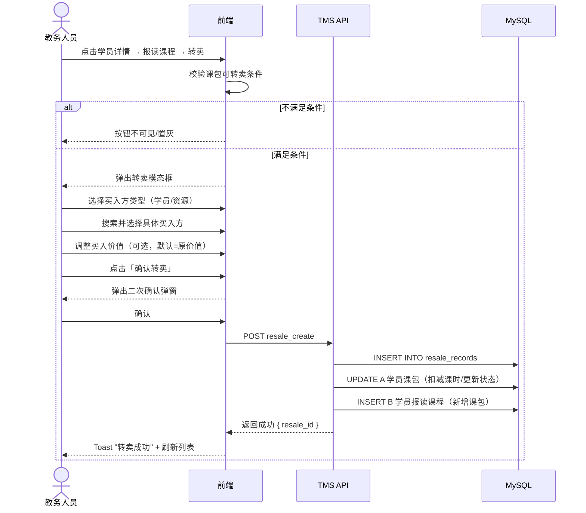

# 课包转卖功能 PRD

> **版本**: v1.0 | **日期**: 2026-07-17 | **作者**: Product Manager (Alice)
> **项目**: TMS 培训管理系统
> **技术栈**: PHP 8.4 + MySQL 8.4 + Vanilla JS, 单文件架构

---

## 1. 产品目标

### 1.1 背景

当前 TMS 学员报读课程后，若因个人原因无法继续上课，已购课时只能浪费。培训机构需要一个灵活的内部流转机制，让学员可以将剩余课时转卖给其他学员或潜在资源，提升课时利用率，同时为机构创造额外收入（差价部分）。

### 1.2 目标

| # | 目标 | 衡量标准 |
|---|------|---------|
| G1 | **盘活存量课时** | 学员可将剩余课时转让给他人，减少退费率 |
| G2 | **增加机构收入** | 转卖差价（卖出-买入）记为机构确认收入 |
| G3 | **双向透明可追溯** | 买卖双方均可在工作记录中查看转卖记录，校区/课程/课时/金额一目了然 |

### 1.3 非目标

- 不涉及跨校区转课（买入方课程校区始终 = 卖出方原校区）
- 不涉及课程内容变更（买入课程 = 卖出课程，完全一致）
- 不涉及线上支付/退款流程（仅记录价值变更，不走支付网关）
- 不改变现有报读课程的核心数据模型（通过新增关联实现）

---

## 2. 用户故事

### 2.1 P0 — 核心流程（必须实现）

| ID | 用户故事 | 验收标准 |
|----|---------|---------|
| US1 | 作为教务人员，我需要在学员报读课程列表中找到「转卖」入口，以便发起课包转卖操作 | 报读课程列表操作列出现「转卖」按钮；仅当课包满足条件时显示（剩余课时>0、未在退费/转校/转卖中） |
| US2 | 作为教务人员，我需要选择买入方（学员或资源）并确认转卖信息，以完成转卖提交 | 转卖弹窗可选择买入学员或买入资源；课时数自动=剩余课时不可修改；买入价值默认=卖出价值可向下调整 |
| US3 | 作为教务人员，我需要在学员详情的工作记录中查看转卖记录，以追踪课时流转历史 | 工作记录新增「转卖记录」Tab，展示买卖双方、课时、金额、校区等完整字段 |

### 2.2 P1 — 完善体验（应该实现）

| ID | 用户故事 | 验收标准 |
|----|---------|---------|
| US4 | 作为卖方学员（A），我需要在报读课程列表中看到课时减少/状态变更，以知晓转卖生效 | A 端课时减少，若全部转出则状态变为「已结课」 |
| US5 | 作为买方学员（B），我需要在报读课程列表中看到新增课包，以确认买入成功 | B 端新增一行报读课程，课程/校区与 A 一致，状态「正常」 |
| US6 | 作为财务人员，我需要转卖差价自动计入营收统计，以便准确核算收入 | 确认收入 = 卖出金额 - 买入金额，记入营收统计报表 |

### 2.3 P2 — 增强功能（可以实现）

| ID | 用户故事 | 验收标准 |
|----|---------|---------|
| US7 | 作为教务人员，我希望转卖前有二次确认弹窗，避免误操作 | 点击确认按钮后弹出确认对话框，展示关键信息摘要 |
| US8 | 作为管理员，我希望在转卖记录中看到税后确认收入，以便做税务核算 | 确认收入（税后）= 确认收入 × (1 - 税率)，税率可配置 |

---

## 3. 需求池

### 3.1 P0 — 必须实现

| ID | 需求 | 说明 |
|----|------|------|
| R1 | **转卖按钮显示逻辑** | 在报读课程列表操作列添加「转卖」按钮，显示条件：`剩余课时 > 0 AND 状态 NOT IN (退费中, 转校中, 转卖中)` |
| R2 | **转卖模态框** | 弹窗包含：买入方类型（学员/资源）、买入方选择、转卖课时数（只读）、转卖价值（可下调不可上调）、确认按钮 |
| R3 | **买入方选择器** | 学员模式：搜索已有学员（姓名/学号）；资源模式：搜索销售线索/公海池资源 |
| R4 | **转卖课时数锁定** | 默认全部剩余课时，**用户不可修改**；B 买入课时数 = A 卖出课时数 |
| R5 | **转卖价值约束** | 默认 B 买入价值 = A 卖出价值（原课包价值），B 端可下调但不可上调：`0 < buyer_amount ≤ transfer_amount` |
| R6 | **转卖记录表** | 新建 `resale_records` 表，完整记录买卖双方、课程、课时、金额、校区等信息 |
| R7 | **工作记录 Tab** | 学员详情页工作记录区新增「转卖记录」Tab，展示列表字段见 §4.3 |
| R8 | **确认收入计算** | `confirmed_revenue = transfer_amount - buyer_amount`，写入 `resale_records.confirmed_revenue` |

### 3.2 P1 — 应该实现

| ID | 需求 | 说明 |
|----|------|------|
| R9 | **A 端课时扣减** | 转卖确认后，A 学员报读课程对应课时减少（部分转卖）或状态变为「已结课」（全部转卖） |
| R10 | **B 端课包生成** | 转卖确认后，B 学员/资源报读课程列表新增一行，课程/校区与 A 一致，课时=转卖课时数 |
| R11 | **营收统计接入** | `confirmed_revenue` 计入 TMS 营收统计报表（参考现有 `revenue-stats-pattern`） |
| R12 | **双向工作记录** | A 和 B 的工作记录中均显示该转卖记录 |

### 3.3 P2 — 可以实现

| ID | 需求 | 说明 |
|----|------|------|
| R13 | **二次确认弹窗** | 转卖确认前展示摘要：卖方、买方、课程、课时、金额、差价 |
| R14 | **税后确认收入** | 新增字段 `confirmed_revenue_after_tax`，根据可配置税率计算 |
| R15 | **转卖审批流程** | 若业务需要，可后续扩展：A 提交 → 审批 → B 确认（当前版本跳过，直接确认） |

---

## 4. UI 设计

### 4.1 报读课程列表 — 转卖按钮

```
┌──────────────────────────────────────────────────────────────────────────────────┐
│  报读课程                                                                         │
├──────────┬──────────┬────────┬────────┬────────┬──────────┬──────────────────────┤
│  课程名称  │  总课时   │ 已用  │ 剩余  │  状态   │  购买日期  │         操作         │
├──────────┼──────────┼────────┼────────┼────────┼──────────┼──────────────────────┤
│  小学奥数  │   100    │  30   │  70   │  正常   │ 2026-03  │ [转卖] [退费] [考勤] │
│  英语进阶  │   60     │  60   │   0   │ 已结课  │ 2025-09  │       — — —         │
│  编程入门  │   40     │  10   │  30   │ 转卖中  │ 2026-05  │     (锁定中)         │
└──────────┴──────────┴────────┴────────┴────────┴──────────┴──────────────────────┘
```

**按钮条件**：仅当 `剩余课时 > 0 AND 状态 NOT IN ('退费中','转校中','转卖中')` 时显示。

### 4.2 转卖模态框

```
┌─────────────────────────────────────────────────────┐
│  课包转卖                                      [✕]  │
├─────────────────────────────────────────────────────┤
│                                                     │
│  卖出方（当前学员）                                  │
│  ┌─────────────────────────────────────────────┐    │
│  │ 学员：张三（XH-20240001）                     │    │
│  │ 课程：小学奥数                                 │    │
│  │ 剩余课时：70 课时                              │    │
│  │ 课程价值：¥7,000（¥100/课时）                  │    │
│  └─────────────────────────────────────────────┘    │
│                                                     │
│  买入方                                             │
│  类型：○ 学员    ○ 资源                              │
│  选择：[请输入姓名或学号搜索...        🔍]           │
│                                                     │
│  ─── 转卖信息 ───                                    │
│  转卖课时数：  70 课时    （不可修改）                │
│                         ↑ 自动 = 全部剩余课时         │
│  转卖价值：   ¥7,000    [－]  ← 仅可下调             │
│               ↑ 默认 = 原价值                        │
│                                                     │
│  确认收入预览：¥0  （卖出 ¥7,000 - 买入 ¥7,000）     │
│                                                     │
├─────────────────────────────────────────────────────┤
│                         [取消]      [确认转卖]       │
└─────────────────────────────────────────────────────┘
```

**交互细节**：
- 买入方类型切换：学员 → 搜索学员表；资源 → 搜索资源池表
- 转卖课时数：只读灰色背景，不可聚焦
- 转卖价值下调：点击 `[－]` 按钮，每次递减一个步长（如 ¥100），或直接输入（校验 ≤ 原价值）
- 确认收入实时预览：`sell_amount - buy_amount`

### 4.3 工作记录 — 转卖记录 Tab

```
┌──────────────────────────────────────────────────────────────────────────────────────────────────────┐
│  工作记录                                                                                             │
│  [考勤记录] [转卖记录] [退费记录] ...                                                                   │
├──────────┬──────────┬──────────┬──────────┬──────────┬──────────┬──────────┬──────────┬──────────────┤
│ 学员姓名 │ 学员学号  │ 课程名称  │ 转出课时  │ 转入课时  │卖出课时金额│买入课时金额│ 确认收入  │ 确认收入(税后)│
├──────────┼──────────┼──────────┼──────────┼──────────┼──────────┼──────────┼──────────┼──────────────┤
│   张三   │XH-2024001│ 小学奥数  │   70     │   70     │ ¥7,000   │ ¥6,500   │  ¥500    │   ¥470      │
├──────────┼──────────┼──────────┼──────────┼──────────┼──────────┼──────────┼──────────┼──────────────┤
│ 是否全部转卖 │  经办校区  │ 购买学员姓名 │ 购买学员学号  │  上课校区  │
│    是       │  高新校区  │    李四      │ XH-2024005  │  高新校区  │
└──────────┴──────────┴──────────┴──────────┴──────────┴──────────┴──────────┴──────────┴──────────────┘
```

**列表字段**（共 13 列）：
1. 学员姓名（卖方）
2. 学员学号（卖方）
3. 课程名称
4. 转出课时
5. 转入课时
6. 卖出课时金额
7. 买入课时金额
8. 确认收入
9. 确认收入（税后）
10. 是否全部转卖
11. 经办校区
12. 购买学员姓名
13. 购买学员学号
14. 上课校区

### 4.4 二次确认弹窗（P2）

```
┌──────────────────────────────────────────┐
│  ⚠️ 确认课包转卖                          │
├──────────────────────────────────────────┤
│                                          │
│  卖出方：张三（XH-20240001）               │
│  买入方：李四（XH-20240005）               │
│  课程：  小学奥数                          │
│  课时：  70 课时                           │
│  卖出金额：¥7,000                          │
│  买入金额：¥6,500                          │
│  确认收入：¥500                            │
│                                          │
│  此操作不可撤销，确认后：                    │
│  · 张三课包课时将减少 70 课时               │
│  · 李四将新增小学奥数课包（70课时）          │
│                                          │
│            [取消]      [确认转卖]          │
└──────────────────────────────────────────┘
```

---

## 5. 业务流程图

### 5.1 转卖主流程（时序图）



### 5.2 课时扣减逻辑

```
A 学员课包 original_lessons = 100, used = 30, remaining = 70

转卖 70 课时（全部）：
  → A.remaining = 0
  → A.status = '已结课'
  → B 新增课包: total_lessons = 70, used = 0, remaining = 70

转卖 30 课时（部分）：
  → A.total_lessons = 70 (100-30)
  → A.remaining = 40 (70-30)
  → A.status = '正常' (仍有剩余)
  → B 新增课包: total_lessons = 30, used = 0, remaining = 30
```

### 5.3 价值结算流程

```
transfer_amount (A 卖出价值) = 原课包价值 × (转卖课时 / 总课时)
例：原课包 ¥10,000 / 100课时 → 转卖70课时 → transfer_amount = ¥7,000

buyer_amount (B 买入价值) = 教务手动调整，满足 0 < buyer_amount ≤ transfer_amount
例：教务调为 ¥6,500

confirmed_revenue = transfer_amount - buyer_amount = ¥500
confirmed_revenue_after_tax = confirmed_revenue × (1 - tax_rate)
```

---

## 6. 数据模型

### 6.1 新表：`resale_records`

```sql
CREATE TABLE resale_records (
    id              INT AUTO_INCREMENT PRIMARY KEY,
    
    -- 卖方信息
    seller_student_id   INT NOT NULL COMMENT '卖方学员ID → students.id',
    
    -- 买方信息（二选一）
    buyer_student_id    INT DEFAULT NULL COMMENT '买方学员ID → students.id（若买入方为学员）',
    buyer_resource_id   INT DEFAULT NULL COMMENT '买方资源ID → resources.id（若买入方为资源）',
    buyer_type          ENUM('student', 'resource') NOT NULL COMMENT '买入方类型',
    
    -- 课程信息
    course_id           INT NOT NULL COMMENT '课程ID → courses.id',
    source_order_id     INT NOT NULL COMMENT '卖方原始报读订单ID → student_orders.id（或对应表）',
    
    -- 课时信息
    transfer_lessons    DECIMAL(8,2) NOT NULL COMMENT '转卖课时数（转出=转入，不可修改）',
    is_full_transfer    TINYINT(1) NOT NULL DEFAULT 0 COMMENT '是否全部转卖（1=是, 0=否）',
    
    -- 金额信息
    transfer_amount     DECIMAL(10,2) NOT NULL COMMENT '卖出课时金额（A端价值）',
    buyer_amount        DECIMAL(10,2) NOT NULL COMMENT '买入课时金额（B端价值，可下调）',
    confirmed_revenue   DECIMAL(10,2) NOT NULL DEFAULT 0 COMMENT '确认收入 = transfer_amount - buyer_amount',
    confirmed_revenue_after_tax DECIMAL(10,2) DEFAULT NULL COMMENT '确认收入（税后）',
    tax_rate            DECIMAL(5,4) DEFAULT NULL COMMENT '适用税率',
    
    -- 校区信息
    campus_id           INT NOT NULL COMMENT '经办校区ID → organizations.id（=卖方原校区）',
    class_campus_id     INT NOT NULL COMMENT '上课校区ID → organizations.id（=卖方原校区，不可变）',
    
    -- 状态
    status              ENUM('pending', 'confirmed', 'cancelled') NOT NULL DEFAULT 'pending' COMMENT '转卖状态',
    
    -- 审计字段
    created_by          INT COMMENT '操作人ID → users.id',
    created_at          DATETIME NOT NULL DEFAULT CURRENT_TIMESTAMP,
    updated_at          DATETIME NOT NULL DEFAULT CURRENT_TIMESTAMP ON UPDATE CURRENT_TIMESTAMP,
    
    -- 索引
    INDEX idx_seller (seller_student_id),
    INDEX idx_buyer_student (buyer_student_id),
    INDEX idx_buyer_resource (buyer_resource_id),
    INDEX idx_course (course_id),
    INDEX idx_status (status),
    INDEX idx_created_at (created_at)
) ENGINE=InnoDB DEFAULT CHARSET=utf8mb4 COMMENT='课包转卖记录表';
```

### 6.2 关联关系

```
resale_records.seller_student_id  → students.id         (卖方)
resale_records.buyer_student_id   → students.id         (买方-学员)
resale_records.buyer_resource_id  → resources.id        (买方-资源)
resale_records.course_id          → courses.id           (课程)
resale_records.source_order_id    → student_orders.id    (原始订单)
resale_records.campus_id          → organizations.id     (经办校区)
resale_records.class_campus_id    → organizations.id     (上课校区)
```

### 6.3 约束检查

```sql
-- CHECK 约束（应用层 + DB层双重保障）
-- 1. buyer_student_id 和 buyer_resource_id 必须有一个非 NULL
--    (buyer_student_id IS NOT NULL AND buyer_resource_id IS NULL) 
--    OR (buyer_student_id IS NULL AND buyer_resource_id IS NOT NULL)

-- 2. buyer_amount > 0 AND buyer_amount <= transfer_amount

-- 3. transfer_lessons > 0
```

### 6.4 对现有表的影响

| 表 | 变更 | 说明 |
|----|------|------|
| `student_orders`（或对应报读表） | 新增字段 `resale_id` 或 `resale_status` | 标记课包是否处于转卖中，阻止并发转卖 |
| `student_orders` | 新增字段 `is_resale_received` | 标记该课包是否为转卖买入（B端视角） |
| 学员详情 API | 新增 `resale_records` 查询 | 工作记录 Tab 的数据来源 |

---

## 7. 技术规范

### 7.1 API 设计

| 端点 | 方法 | 说明 |
|------|------|------|
| `resale_create` | POST | 创建转卖记录，A 端课时冻结 |
| `resale_confirm` | POST | 确认转卖（当前版本直接确认，跳过 pending） |
| `resale_cancel` | POST | 取消转卖，A 端课时恢复 |
| `resale_list` | GET | 查询转卖记录列表（按学员/课程/日期筛选） |
| `resale_detail` | GET | 查询单条转卖记录详情 |

### 7.2 前端文件变更预估

| 文件 | 变更 | 行数估算 |
|------|------|---------|
| `static/js/main.js` | 新增 `showResaleModal` | ~150 行 |
| `static/js/main.js` | 新增 `submitResale` | ~80 行 |
| `static/js/main.js` | 工作记录 Tab「转卖记录」渲染 | ~60 行 |
| `static/css/style.css` | 转卖弹窗样式 | ~40 行 |
| `index.php` | 新增 API 端点 | ~120 行 |

### 7.3 安全 / 边界条件

| 场景 | 处理 |
|------|------|
| 同一课包重复转卖 | 转卖中状态锁定，前端按钮隐藏 + 后端校验 |
| 转卖课时数 ≤ 0 | 前端不显示按钮，后端校验拒绝 |
| 买入金额 > 卖出金额 | 前端输入框限制 + 后端校验 |
| 买入方 = 卖出方 | 前端搜索过滤 + 后端校验 |
| 并发转卖同一课包 | DB 行锁 / 状态检查 |
| 买入方已有同名课程 | 允许，新增一行课包（不合并） |

---

## 8. 待确认问题

| # | 问题 | 上下文 | 建议 |
|---|------|--------|------|
| Q1 | **「资源」是什么？** | 需求中提到买入方可为「资源（销售线索/公海池）」。当前系统是否有资源表？买入方为资源时，资源转换为学员的时机是什么？ | 确认现有 `resources` / `leads` 表结构；建议资源买入后自动转为学员或生成关联记录 |
| Q2 | **转卖是否需要审批流程？** | 当前需求描述为「A 提交 → B 确认」，中间是否需要审批？ | 建议 P0 版本跳过审批（直接确认），P2 加入可配置审批流 |
| Q3 | **税率如何确定？** | 税后确认收入需要税率。税率是全局配置还是按校区/课程？ | 建议先设为系统配置项（全局税率），默认 6% |
| Q4 | **课时数是否完全不可修改？** | 需求描述为「用户不能修改」。是否支持最小转卖量限制？比如至少转卖 1 课时？ | 建议默认为全部剩余课时不可修改，支持配置「最小转卖课时数」 |
| Q5 | **买入方为资源时，报读课程如何展示？** | 资源不是学员，没有报读课程列表。转卖记录如何关联？ | 建议转卖确认时，若买入方为资源，系统自动创建学员档案或挂起等待资源转化 |
| Q6 | **报读课程表名确认** | 需求中提到「报读课程」列表，需确认对应数据库表名（`student_orders` / `student_courses` / 其他？） | 待确认现有表结构后填写 |
| Q7 | **转卖确认收入的科目归属** | `confirmed_revenue` 应计入哪个营收科目？与学费收入如何区分？ | 建议新增「转卖收入」科目，在营收统计报表中单独展示 |

---

## 9. 附录

### A. 相关参考

| 参考 | 路径 |
|------|------|
| 营收统计模式 | `.hermes/skills/software-development/tms-system/references/revenue-stats-pattern.md` |
| JS 冲突陷阱 | `.hermes/skills/software-development/tms-dev/references/js-collisions.md` |
| 开发陷阱 | `.hermes/skills/software-development/tms-dev/references/pitfalls.md` |

### B. 术语表

| 术语 | 说明 |
|------|------|
| 课包 | 学员报读的课程实例，包含总课时、已用课时、剩余课时、状态 |
| 转卖 | 学员将课包剩余课时转让给其他学员或资源 |
| 卖出价值 | A 端原课包对应转卖课时的价值（transfer_amount） |
| 买入价值 | B 端实际支付的课时价值（buyer_amount），≤ 卖出价值 |
| 确认收入 | 差价 = 卖出价值 - 买入价值（confirmed_revenue） |
| 资源 | 销售线索/公海池中的潜在学员，尚未正式报名 |
