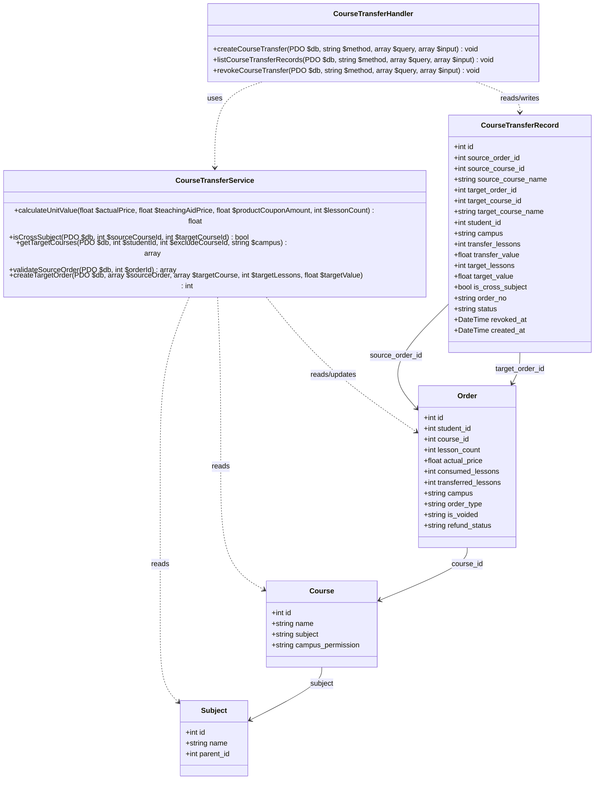
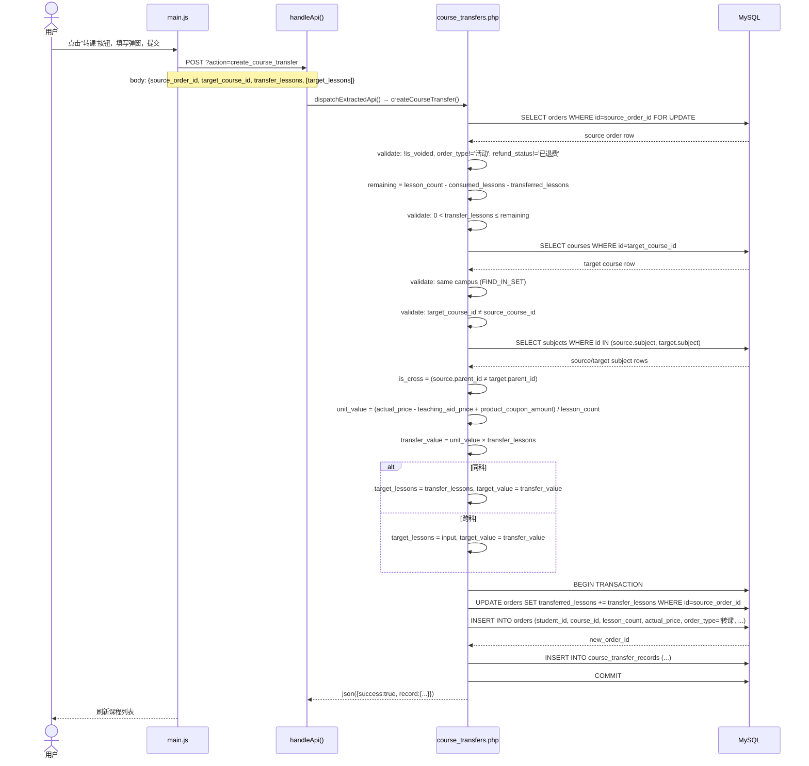
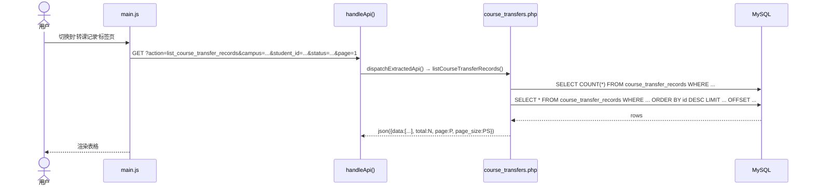
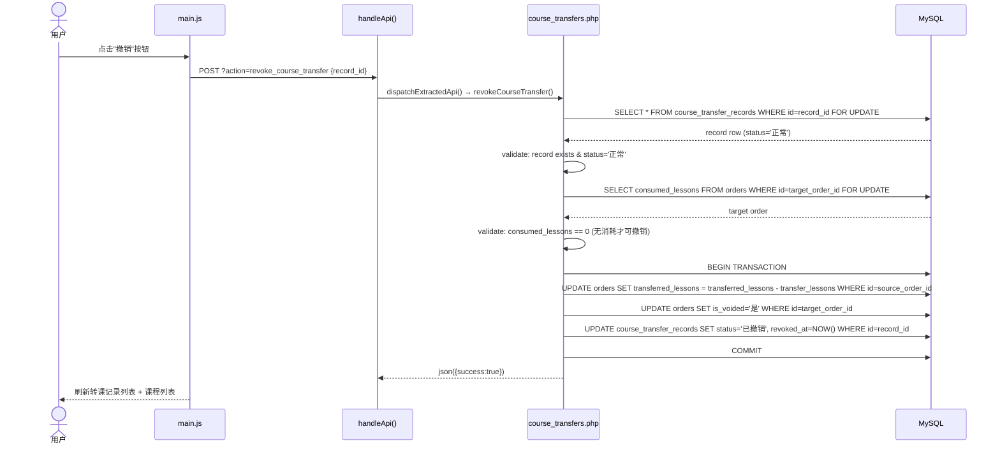
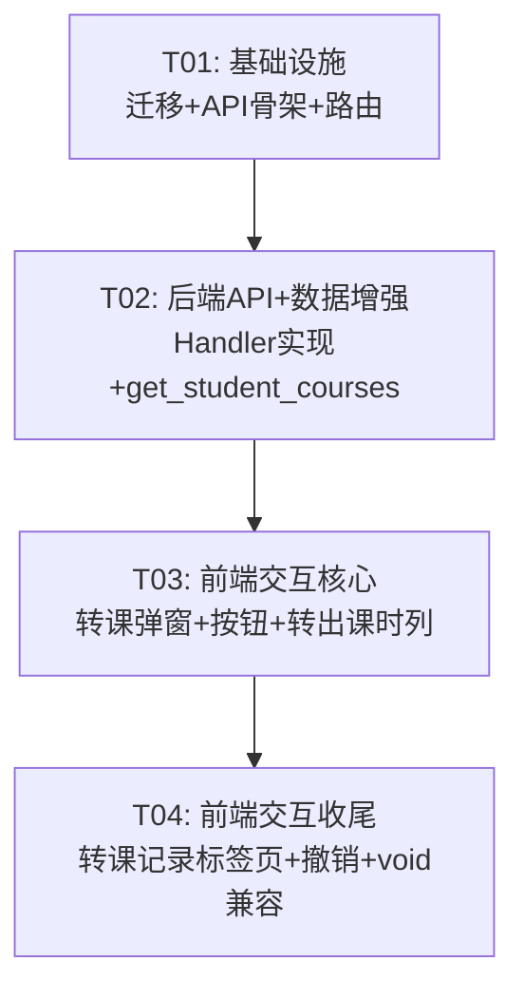

# 转课功能 — 系统设计文档

## Part A: 系统设计

---

### 1. 实现方案

#### 核心技术难点

| 难点 | 方案 |
|------|------|
| **单课时价值计算** | `unit_value = (actual_price - teaching_aid_price + product_coupon_amount) / lesson_count`，与现有 `get_student_courses` 算法一致 |
| **跨学科判断** | 查询 `courses.subject` → `subjects.id` → `subjects.parent_id`，比较 `parent_id` 是否相同 |
| **价值无损锚定** | 转出价值 = unit_value × transfer_lessons；跨学科时目标课时可编辑但目标价值=转出价值；同科时 1:1 |
| **多次转出** | 复用 orders 表已有 `transferred_lessons` 字段，每次转出累加（转校/转课共享该字段） |
| **撤销安全** | 仅当目标订单 `consumed_lessons = 0` 时可撤销，事务内恢复源订单+软删除目标订单 |
| **赠课处理** | 赠课 `actual_price=0`，价值为 0，可转出但目标课包价值=0 |

#### 框架与库选型

- **后端**：沿用 PHP 8.4 + PDO + MySQL 8.4，无新增框架
- **前端**：沿用 Vanilla JS + CSS3，无新增库
- **API 模块化**：新建 `api/course_transfers.php`，注册到 `api/router.php` 的 `dispatchExtractedApi()` 路由
- **数据库迁移**：新增 `migrations/versions/20260718_001_course_transfer_records.php`

#### 架构模式

- 后端：Handler 函数模式（与现有 orders.php 一致）→ `handler(PDO $db, string $method, array $query, array $input): void`
- 前端：全局函数 + DOM 操作（与现有 main.js 一致）
- 路由：`api/router.php` → `dispatchExtractedApi()` 优先级高于 `index.php` switch

---

### 2. 文件列表

| 路径 | 操作 | 说明 |
|------|------|------|
| `migrations/versions/20260718_001_course_transfer_records.php` | **新建** | 创建 `course_transfer_records` 表 |
| `api/course_transfers.php` | **新建** | 转课 API（3 个 handler） |
| `api/router.php` | **修改** | 注册 course_transfer 路由 |
| `index.php` | **修改** | ① `get_student_courses` 新增转课相关字段；② `panel-work-records` 新增转课记录标签页 |
| `static/js/main.js` | **修改** | 转课弹窗、转课按钮逻辑、转课记录标签页 JS、撤销操作 |
| `static/css/style.css` | **修改** | 转课弹窗样式、转课记录表格样式、转出课时高亮样式 |

---

### 3. 数据结构与接口

#### 3.1 数据库表

```sql
CREATE TABLE course_transfer_records (
    id INT AUTO_INCREMENT PRIMARY KEY,
    source_order_id INT NOT NULL COMMENT '源订单ID',
    source_course_id INT NOT NULL COMMENT '源课程ID',
    source_course_name VARCHAR(200) NOT NULL DEFAULT '' COMMENT '源课程名称',
    target_order_id INT NOT NULL DEFAULT 0 COMMENT '目标订单ID（生成的转课课包）',
    target_course_id INT NOT NULL COMMENT '目标课程ID',
    target_course_name VARCHAR(200) NOT NULL DEFAULT '' COMMENT '目标课程名称',
    student_id INT NOT NULL COMMENT '学员ID',
    campus VARCHAR(200) NOT NULL DEFAULT '' COMMENT '校区（同校区）',
    transfer_lessons INT NOT NULL DEFAULT 0 COMMENT '转出课时数',
    transfer_value DECIMAL(10,2) NOT NULL DEFAULT 0 COMMENT '转出价值（源课程课时价值×转出课时）',
    target_lessons INT NOT NULL DEFAULT 0 COMMENT '目标课时数（跨科可能不同）',
    target_value DECIMAL(10,2) NOT NULL DEFAULT 0 COMMENT '目标价值（=转出价值，价值锚定）',
    is_cross_subject TINYINT(1) NOT NULL DEFAULT 0 COMMENT '是否跨学科',
    order_no VARCHAR(20) NOT NULL DEFAULT '' COMMENT '转课流水号',
    status VARCHAR(20) NOT NULL DEFAULT '正常' COMMENT '正常/已撤销',
    revoked_at DATETIME DEFAULT NULL COMMENT '撤销时间',
    created_at DATETIME DEFAULT CURRENT_TIMESTAMP,
    INDEX idx_student (student_id),
    INDEX idx_source_order (source_order_id),
    INDEX idx_target (target_order_id)
) ENGINE=InnoDB DEFAULT CHARSET=utf8mb4 COMMENT='同校区课程间转课记录';
```

#### 3.2 类图（Mermaid）



---

### 4. 程序调用流程

#### 4.1 创建转课（create_course_transfer）



#### 4.2 查询转课记录（list_course_transfer_records）



#### 4.3 撤销转课（revoke_course_transfer）



---

### 5. 待明确事项与假设

| # | 事项 | 决定 |
|---|------|------|
| D1 | Q1 审批流 | **P0 提交即生效**，无需审批 |
| D2 | Q2 剩余归零 | **标记不隐藏**：灰色背景 + 文字"已用完" |
| D3 | Q3 多次转出 | **支持**，累计到 `transferred_lessons` |
| D4 | Q4 目标 order_type | **`'转课'`** |
| D5 | Q5 赠课可转 | **可转**，价值为 0 |
| D6 | Q6 转课课包再转出 | **允许**，形成完整流转链路 |
| D7 | 转出课时精度 | 整数课时，不支持小数 |
| D8 | 跨科目标课时校验 | 目标课时必须 0 < target_lessons（由前端限制） |
| D9 | order_no 格式 | 沿用 `generateOrderNo()` 生成（时间戳+随机数） |
| D10 | 校区判断 | `FIND_IN_SET(campus, courses.campus_permission)` 匹配源订单校区 |
| D11 | 目标课程下拉数据来源 | `get_student_courses` 已返回的**同校区其他课程**（不需要额外 API） |

---

## Part B: 任务分解

### 6. 所需依赖包

无需新增第三方依赖。全部使用项目已有技术栈：
```
- PHP 8.4（已有 PDO/MySQL 扩展）
- Vanilla JS（无额外库）
- CSS3（无额外框架）
```

---

### 7. 任务列表（按依赖排序）

#### T01: 项目基础设施（P0）

| 字段 | 内容 |
|------|------|
| **Task ID** | T01 |
| **Task Name** | 数据库迁移 + API 模块骨架 + 路由注册 |
| **Source Files** | `migrations/versions/20260718_001_course_transfer_records.php`（新建）、`api/course_transfers.php`（新建）、`api/router.php`（修改） |
| **Dependencies** | 无 |
| **Priority** | P0 |

**工作内容**：

1. **新建迁移文件** `migrations/versions/20260718_001_course_transfer_records.php`
   - 创建 `course_transfer_records` 表（DDL 见 §3.1）
   - 返回标准迁移数组 `['version' => '...', 'description' => '...', 'up' => fn(PDO $db)]`

2. **新建 API 模块** `api/course_transfers.php`
   - 创建 `courseTransferApiRoutes()` 函数，返回 `['create_course_transfer' => 'createCourseTransfer', 'list_course_transfer_records' => 'listCourseTransferRecords', 'revoke_course_transfer' => 'revokeCourseTransfer']`
   - 声明三个 handler 函数签名（骨架，具体逻辑在 T02 实现）

3. **修改路由注册** `api/router.php`
   - 在文件顶部 `require_once __DIR__ . '/course_transfers.php';`
   - 在 `buildExtractedApiRoutes()` 的 `foreach` 数组中添加 `courseTransferApiRoutes()`

---

#### T02: 后端 API 全量实现 + 学员课程数据增强（P0）

| 字段 | 内容 |
|------|------|
| **Task ID** | T02 |
| **Task Name** | API Handler 实现 + get_student_courses 增强 + 工作记录标签页 HTML |
| **Source Files** | `api/course_transfers.php`（修改）、`index.php`（修改，2 处）、`static/js/main.js`（修改，API 调用路径准备） |
| **Dependencies** | T01 |
| **Priority** | P0 |

**工作内容**：

1. **实现 `createCourseTransfer`** handler（`api/course_transfers.php`）
   - 校验：`method === 'POST'`
   - 提取参数：`source_order_id`, `target_course_id`, `transfer_lessons`, `target_lessons`（跨科时必填）
   - 源订单校验（事务 + 行锁）：
     - 订单存在、`is_voided='否'`、`order_type != '活动'`、`refund_status NOT IN ('已退费','退费申请中')`
     - 计算 `remaining = lesson_count - consumed_lessons - transferred_lessons`，校验 `0 < transfer_lessons ≤ remaining`
   - 目标课程校验：
     - 课程存在、同校区（`FIND_IN_SET(campus, campus_permission)`）、不同于源课程
   - 跨学科判断：
     - 查 `subjects` 表比较 `parent_id`
   - 价值计算：
     - `unit_value = (actual_price - teaching_aid_price + product_coupon_amount) / lesson_count`
     - `transfer_value = round(unit_value * transfer_lessons, 2)`
     - 同科：`target_lessons = transfer_lessons, target_value = transfer_value`
     - 跨科：`target_lessons = input['target_lessons'], target_value = transfer_value`
   - 事务内操作：
     1. `UPDATE orders SET transferred_lessons = transferred_lessons + transfer_lessons WHERE id = source_order_id`
     2. 生成目标订单（INSERT INTO orders）：
        - `student_id`, `course_id=target_course_id`, `lesson_count=target_lessons`, `actual_price=target_value`
        - `order_type='转课'`, `campus=source.campus`, `order_no=generateOrderNo($db)`
        - `status='已报名'`, `is_voided='否'`, `pay_status='已支付'`
        - `subject_level1/subject_level2` 从目标课程/subjects 获取
     3. `INSERT INTO course_transfer_records` 写入完整记录
     4. COMMIT
   - 返回 `json(['success' => true, 'record' => [...], 'target_order_id' => $newOrderId])`

2. **实现 `listCourseTransferRecords`** handler（`api/course_transfers.php`）
   - 支持筛选：`campus`, `student_id`, `date_from`, `date_to`, `status`, `keyword`（搜索学员名/课程名）
   - 分页：`page`, `page_size`（默认 20，最大 50）
   - 返回 `json(['data' => [...], 'total' => N, 'page' => P, 'page_size' => PS])`

3. **实现 `revokeCourseTransfer`** handler（`api/course_transfers.php`）
   - 校验：`method === 'POST'`，提取 `record_id`
   - 事务 + 行锁查记录（`status='正常'`）
   - 查目标订单 `consumed_lessons`，必须为 0
   - 事务内：
     1. `UPDATE orders SET transferred_lessons = transferred_lessons - transfer_lessons WHERE id = source_order_id`
     2. `UPDATE orders SET is_voided = '是' WHERE id = target_order_id`
     3. `UPDATE course_transfer_records SET status = '已撤销', revoked_at = NOW() WHERE id = record_id`
     4. COMMIT
   - 返回 `json(['success' => true])`

4. **修改 `get_student_courses`**（`index.php` 约行 2477-2618）
   - 查询中已包含 `o.transferred_lessons`（无需改动 SQL）
   - **新增**：在返回数据中额外传递 `transferred_out = transferred_lessons`（明确字段名）
   - **新增**：返回 `transfer_source_order_id = o.id`（用于前端判断转课按钮条件）
   - **新增**：在计算 `remaining_lessons` 时已扣除 `transferred_lessons`（现有逻辑已处理，确认不遗漏）

5. **新增转课记录标签页 HTML**（`index.php`，插入到 `panel-work-records` 的 section-tabs 和 section-tab-content 中）
   - 在"退费记录"和"转校记录"标签之间新增 `<button class="sec-tab" data-tab="tab-course-transfer-records">转课记录</button>`
   - 新建 `<div class="sec-panel" id="tab-course-transfer-records">` 包含：
     - 筛选栏：校区下拉、学员搜索、日期范围、状态（全部/正常/已撤销）
     - 表格：`<table id="table-course-transfer-records">`，列：流水号、学员、源课程→目标课程、转出课时、目标课时、价值、跨科标记、申请人、时间、操作（撤销按钮）

6. **main.js 占位函数**（`static/js/main.js`）
   - 添加 `loadCourseTransferRecords()`、`renderCourseTransferRecordsTable()` 空函数骨架
   - 添加标签页切换逻辑（`tab-course-transfer-records` → 调用 `loadCourseTransferRecords()`）

---

#### T03: 前端交互 — 转课弹窗 + 操作按钮（P0）

| 字段 | 内容 |
|------|------|
| **Task ID** | T03 |
| **Task Name** | 转课弹窗、转课按钮条件判断、提交逻辑、转出课时列 |
| **Source Files** | `static/js/main.js`（修改）、`static/css/style.css`（修改）、`index.php`（修改，操作列 HTML） |
| **Dependencies** | T02 |
| **Priority** | P0 |

**工作内容**：

1. **转课按钮条件判断**（修改 `renderStudentCoursesTable`，约行 6345-6437）
   - 转课按钮显示条件（全部满足）：
     - `order_type != '活动'`
     - `refund_status IN ('正常', null, '')`（非退费中/已退费）
     - `remaining_lessons > 0`（`lesson_count - consumed_lessons - transferred_lessons > 0`）
     - `is_voided = '否'`
     - 同校区有其他可选课程
   - 按钮文字："转课"，CSS class `btn-transfer`
   - 赠课行（`actual_price === 0 && item_name.includes('赠送')`）：如符合条件也显示转课按钮（价值为 0）

2. **新增"转出课时"列**（修改 `renderStudentCoursesTable`）
   - 在表头和表体中，"剩余课时"列之前新增"转出课时"列
   - 值 = `transferred_lessons`（来自后端）
   - `0` 显示 `-`（灰色），`>0` 显示数字（橙色高亮 `#e67e22`）

3. **转课弹窗实现**（新增函数 `showCourseTransferModal(orderId)`）
   - 弹窗布局：
     - 源课程信息（课程名、校区、剩余课时、单课时价值）
     - 转出课时输入框（`<input type="number">`，范围 1 ~ remaining_lessons）
     - 目标课程下拉框（`<select>`，动态填充同校区其他课程）
     - 跨学科时显示目标课时输入框
     - 价值预览区：实时计算转出价值
   - 目标课程下拉数据来源：当前学员的 `studentCoursesAllRows`，筛选 `campus === source.campus && course_id !== source.course_id`
   - 跨学科检测：前端根据 `subject_level1` 判断（与后端 `parent_id` 逻辑对齐，简化处理：`subject_level1` 不同即为跨学科）
   - 目标课时：同科时自动 = 转出课时（只读）；跨科时可编辑

4. **提交转课**（新增函数 `submitCourseTransfer()`）
   - 验证输入有效性
   - POST 到 `?action=create_course_transfer`
   - 成功后刷新学员课程列表 + toast 提示

5. **剩余归零视觉标记**（修改 `renderStudentCoursesTable`）
   - 当 `remaining_lessons === 0 && lesson_count > 0` 时，该行加 CSS class `row-depleted`（浅灰背景 `#f5f5f5`，文字颜色 `#999`）

6. **CSS 样式**（`static/css/style.css`）
   - `.row-depleted` 样式
   - `.col-transferred` 转出课时列样式（橙色高亮）
   - `.modal-course-transfer` 弹窗样式（表单布局、价值预览区）
   - `.tag-cross-subject` 跨科标签样式

---

#### T04: 前端交互 — 转课记录标签页 + 撤销功能 + 集成收尾（P1）

| 字段 | 内容 |
|------|------|
| **Task ID** | T04 |
| **Task Name** | 转课记录标签页完整实现 + 撤销操作 + 最终集成 |
| **Source Files** | `static/js/main.js`（修改）、`static/css/style.css`（修改）、`index.php`（修改，void_order 兼容检查） |
| **Dependencies** | T03 |
| **Priority** | P1 |

**工作内容**：

1. **转课记录列表加载**（实现 `loadCourseTransferRecords`）
   - 从筛选控件读取参数：校区、学员搜索、日期范围、状态
   - GET 请求 `?action=list_course_transfer_records` + 参数
   - 分页处理（复用现有 pagination 模式）

2. **转课记录表格渲染**（实现 `renderCourseTransferRecordsTable`）
   - 列：流水号（`order_no`）、学员（通过 `student_id` 查名称）、源课程→目标课程（箭头表示）、转出课时、目标课时、价值、跨科标记（`is_cross_subject ? '是' : '否'`）、时间（`created_at`）、操作
   - 操作列：状态为"正常"时显示"撤销"按钮；"已撤销"时灰色显示"已撤销"
   - 分页组件渲染

3. **撤销转课**（新增函数 `revokeCourseTransfer(recordId)`）
   - 二次确认弹窗：提示撤销后目标课包将作废，源课程课时恢复
   - POST 到 `?action=revoke_course_transfer`，body `{record_id: recordId}`
   - 成功：刷新转课记录列表 + toast 提示
   - 失败：显示具体错误信息（如"目标课包已有消耗，无法撤销"）

4. **void_order 兼容**（修改 `api/orders.php` 的 `voidOrder` 函数，约行 631-759）
   - 在现有 `transferred_lessons > 0` 检查之后，新增对 `course_transfer_records` 的检查：
     - 查询 `SELECT COUNT(*) FROM course_transfer_records WHERE source_order_id = :oid AND status = '正常'`
     - 如存在记录，回滚并提示"该订单已发生转课，无法作废"
   - 同时检查目标订单（`order_type='转课'`）：允许作废但需检查 `consumed_lessons = 0`

5. **最终 CSS 收尾**
   - 转课记录表格列样式
   - 撤销按钮样式
   - 二次确认弹窗样式（或复用现有确认模式）

---

### 8. 共享知识

```
===== 命名约定 =====
- API action 名：snake_case，如 create_course_transfer, list_course_transfer_records, revoke_course_transfer
- JS 函数名：camelCase，如 showCourseTransferModal, submitCourseTransfer, revokeCourseTransfer
- JS 全局变量：camelCase 前缀，如 courseTransferTargetOrderId, courseTransferCurrentData
- CSS class：kebab-case，如 .modal-course-transfer, .row-depleted, .col-transferred
- 数据库表/列：snake_case，如 course_transfer_records, source_order_id

===== 常量定义 =====
- ORDER_TYPE_TRANSFER_COURSE = '转课'  （目标订单 order_type）
- TRANSFER_STATUS_NORMAL = '正常'
- TRANSFER_STATUS_REVOKED = '已撤销'

===== 公共函数（复用现有） =====
- generateOrderNo(PDO $db): string  -- app/order_helpers.php
- json(mixed $data): never          -- app/helpers.php
- h(mixed $value): string           -- app/helpers.php
- now(): string                     -- app/helpers.php

===== API 响应格式 =====
- 成功：{"success": true, ...具体数据}
- 失败：{"error": "错误描述"} 或 {"success": false, "message": "错误描述"}

===== 事务规范 =====
- 所有写操作必须 beginTransaction + try/catch + rollBack/commit
- 查询源订单/目标订单必须 FOR UPDATE 行锁
- 回滚时错误日志写入 error_log()

===== 安全规范 =====
- 所有 SQL 参数使用 prepared statement（命名参数 :xxx）
- JSON 输入通过 $input = json_decode(file_get_contents('php://input'), true) ?? []
- 整数参数 intval() 强制转型
```

---

### 9. 任务依赖关系图


