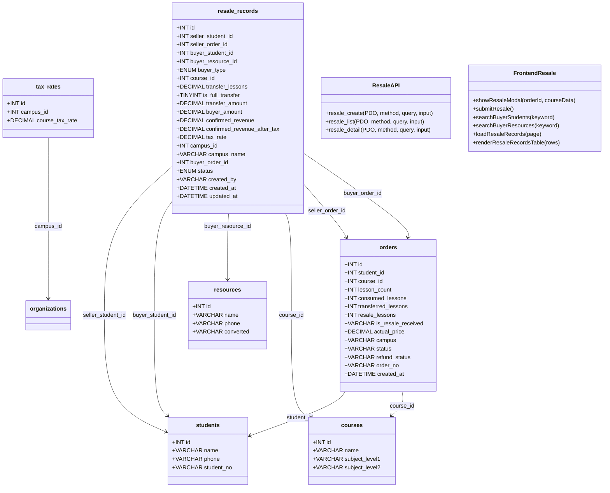
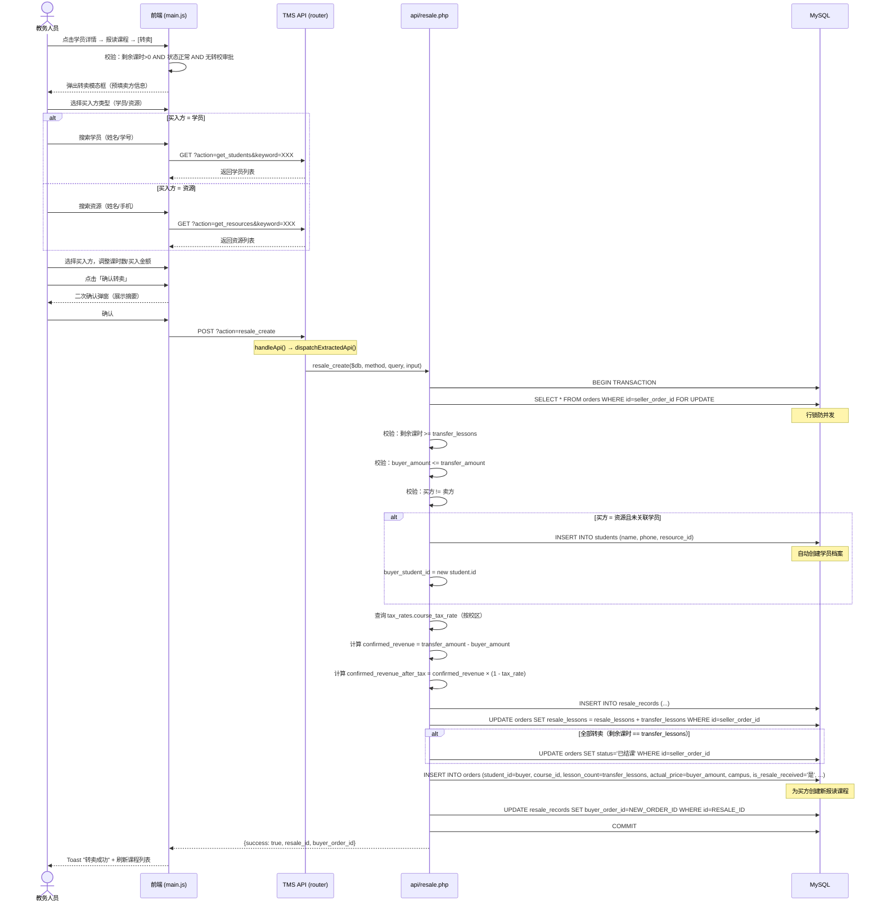
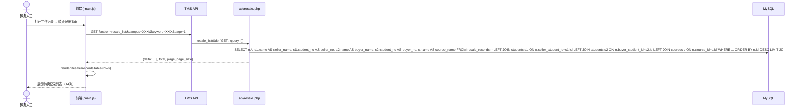
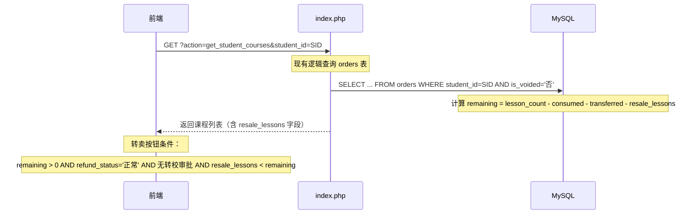
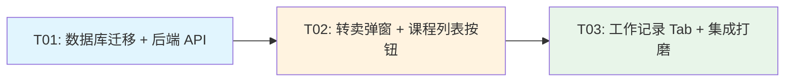

# 课包转卖功能 — 系统架构设计

> **版本**: v1.0 | **日期**: 2026-07-18 | **作者**: Architect (Bob)
> **基于 PRD**: `.hermes/prd-course-resale.md` + 用户补充说明

---

## Part A: 系统设计

### 1. 实现方案

#### 1.1 核心技术挑战

| 挑战 | 分析 | 解决方案 |
|------|------|---------|
| **并发转卖同一课包** | A 的同一订单可能被两个教务同时转卖 | 数据库事务 + `SELECT ... FOR UPDATE` 行锁 |
| **买方为资源时自动转学员** | 资源无 orders 记录，需自动创建学员档案 | 事务内先 `INSERT INTO students`（若资源尚未关联），再基于新学员 ID 创建订单 |
| **课时部分转卖** | 用户可改小课时数，剩余归卖方保留 | 新增 `resale_lessons` 字段跟踪已转卖课时；remaining = lesson_count - consumed - transferred - resale |
| **买入金额 ≤ 卖出金额** | 前后端双重校验 | 前端 `max` 属性限制 + 后端 `if ($buyerAmount > $transferAmount)` 拒绝 |
| **转卖记录展示** | 14 列宽表，买卖双方信息需 JOIN | LEFT JOIN students（卖方） + LEFT JOIN students（买方学员） + LEFT JOIN resources（买方资源） |

#### 1.2 框架与库选型

沿用现有技术栈，**零新增依赖**：

| 层级 | 技术 | 说明 |
|------|------|------|
| 后端 | PHP 8.4 + PDO (MySQL 8.4) | 沿用现有单文件架构 + 提取 API 模块模式 |
| 前端 | Vanilla JS（ES2020+） | 沿用现有 `static/js/main.js` 模式，无框架 |
| 样式 | 原生 CSS | 沿用现有 `static/css/style.css`（最新版本） |
| 数据库迁移 | MigrationRunner | 沿用现有 `migrations/` 目录模式 |

#### 1.3 架构模式

- **后端**: 提取式 API 模块（`api/resale.php`），遵循 `api/course_transfers.php` 的 `functionName → routeName` 模式
- **前端**: 函数式组件（`showResaleModal()`, `submitResale()`, `loadResaleRecords()`）
- **数据流**: 前端 → `?action=resale_create` → `handleApi()` → `dispatchExtractedApi()` → `api/resale.php`

---

### 2. 文件列表

```
market-system-php/
├── migrations/
│   └── versions/
│       └── 20260718_001_resale_schema.php    # [新建] 数据库迁移：resale_records 表 + orders 表变更
├── api/
│   ├── resale.php                             # [新建] 转卖 API 模块（resale_create, resale_list, resale_detail）
│   └── router.php                             # [修改] 注册 resaleApiRoutes
├── static/
│   ├── js/
│   │   └── main.js                            # [修改] 转卖弹窗 + 提交 + 工作记录 Tab + 课程列表按钮
│   └── css/
│       └── style.css                          # [修改] 转卖弹窗样式 + 工作记录表格样式
└── index.php                                  # [修改] 工作记录区新增「转卖记录」Tab HTML
```

**变更统计**：新建 2 文件，修改 4 文件。

---

### 3. 数据结构与接口

#### 3.1 DDL — 新表 `resale_records`

```sql
CREATE TABLE resale_records (
    id              INT AUTO_INCREMENT PRIMARY KEY,
    
    -- 卖方信息
    seller_student_id   INT NOT NULL COMMENT '卖方学员ID → students.id',
    seller_order_id     INT NOT NULL COMMENT '卖方原始报读订单ID → orders.id',
    
    -- 买方信息（二选一，应用层 CHECK）
    buyer_student_id    INT DEFAULT NULL COMMENT '买方学员ID → students.id',
    buyer_resource_id   INT DEFAULT NULL COMMENT '买方资源ID → resources.id（若买入方为资源）',
    buyer_type          ENUM('student', 'resource') NOT NULL COMMENT '买入方类型',
    
    -- 课程信息
    course_id           INT NOT NULL COMMENT '课程ID → courses.id',
    
    -- 课时信息
    transfer_lessons    DECIMAL(8,2) NOT NULL COMMENT '转卖课时数',
    is_full_transfer    TINYINT(1) NOT NULL DEFAULT 0 COMMENT '是否全部转卖（1=是, 0=否）',
    
    -- 金额信息
    transfer_amount     DECIMAL(10,2) NOT NULL COMMENT '卖出课时金额（A端价值）',
    buyer_amount        DECIMAL(10,2) NOT NULL COMMENT '买入课时金额（B端价值，≤transfer_amount）',
    confirmed_revenue   DECIMAL(10,2) NOT NULL DEFAULT 0 COMMENT '确认收入 = transfer_amount - buyer_amount',
    confirmed_revenue_after_tax DECIMAL(10,2) DEFAULT NULL COMMENT '确认收入（税后）',
    tax_rate            DECIMAL(5,4) DEFAULT NULL COMMENT '适用税率（课耗税率）',
    
    -- 校区信息
    campus_id           INT DEFAULT 0 COMMENT '经办校区ID（=卖方原校区）',
    campus_name         VARCHAR(500) DEFAULT '' COMMENT '经办校区名称（冗余）',
    
    -- 买方订单（转卖后生成）
    buyer_order_id      INT DEFAULT 0 COMMENT '买方新生成的订单ID → orders.id',
    
    -- 状态（无审批，直接 confirmed）
    status              ENUM('confirmed', 'cancelled') NOT NULL DEFAULT 'confirmed' COMMENT '转卖状态',
    
    -- 审计字段
    created_by          VARCHAR(200) DEFAULT '' COMMENT '操作人姓名',
    created_at          DATETIME NOT NULL DEFAULT CURRENT_TIMESTAMP,
    updated_at          DATETIME NOT NULL DEFAULT CURRENT_TIMESTAMP ON UPDATE CURRENT_TIMESTAMP,
    
    -- 索引
    INDEX idx_seller_student (seller_student_id),
    INDEX idx_buyer_student (buyer_student_id),
    INDEX idx_buyer_resource (buyer_resource_id),
    INDEX idx_course (course_id),
    INDEX idx_status (status),
    INDEX idx_created_at (created_at),
    INDEX idx_seller_order (seller_order_id)
) ENGINE=InnoDB DEFAULT CHARSET=utf8mb4 COMMENT='课包转卖记录表';
```

#### 3.2 DDL — 修改现有表 `orders`

```sql
-- 卖方订单：跟踪已转卖的课时数
ALTER TABLE orders ADD COLUMN resale_lessons INT DEFAULT 0 COMMENT '已转卖课时数';
-- 买方订单：标记是否为转卖买入
ALTER TABLE orders ADD COLUMN is_resale_received VARCHAR(5) DEFAULT '' COMMENT '是否转卖买入（是/空）';
```

#### 3.3 类图



---

### 4. 程序调用流程

#### 4.1 转卖创建（主流程）



#### 4.2 转卖记录列表查询



#### 4.3 转卖影响 get_student_courses



---

### 5. 待明确事项

| # | 问题 | 当前假设 |
|---|------|---------|
| Q1 | **转卖记录是否可撤销？** | 假设 P0 暂不支持撤销（status 仅有 confirmed），P2 可加入 cancelled |
| Q2 | **买方为资源时，资源已存在关联学员（converted=已转化）的情况如何处理？** | 使用已关联的学员 ID，不重复创建 |
| Q3 | **转卖后卖方订单的 `transferred_lessons` 和 `resale_lessons` 如何共存？** | 两者独立：`transferred_lessons` 给转课/转校用，`resale_lessons` 给转卖用；remaining = lesson_count - consumed - transferred - resale |
| Q4 | **确认收入是否计入营收统计？** | 根据用户补充：先计 `resale_records` 表记录，不归入营收科目（P2 再接入营收统计） |
| Q5 | **买入金额的下调粒度？** | 假设支持任意金额输入（≥ 0.01），前端做 `≤ transfer_amount` 校验；步长 ¥100 |

---

## Part B: 任务分解

### 6. 依赖包列表

**零新增依赖**。所有功能基于现有技术栈实现：
- PHP 8.4 + PDO（已安装）
- MySQL 8.4（已安装）
- Vanilla JS（浏览器原生）
- 原生 CSS

---

### 7. 任务列表

#### T01 — 数据库迁移 + 后端 API 层

| 属性 | 值 |
|------|-----|
| **Task ID** | T01 |
| **Task Name** | 数据库迁移与后端 API 实现 |
| **Priority** | P0 |
| **Dependencies** | 无 |
| **Source Files** | 3 |

**涉及文件**：

| 文件 | 操作 | 预估行数 |
|------|------|---------|
| `migrations/versions/20260718_001_resale_schema.php` | 新建 | ~80 行 |
| `api/resale.php` | 新建 | ~250 行 |
| `api/router.php` | 修改 | +5 行 |

**详细内容**：

1. **`migrations/versions/20260718_001_resale_schema.php`**（新建）
   - `up` 回调：`CREATE TABLE resale_records`（完整 DDL 如 §3.1）
   - `up` 回调：`ALTER TABLE orders ADD COLUMN resale_lessons INT DEFAULT 0`
   - `up` 回调：`ALTER TABLE orders ADD COLUMN is_resale_received VARCHAR(5) DEFAULT ''`
   - 索引创建（含 try-catch 兼容已有索引）

2. **`api/resale.php`**（新建）
   - `resaleApiRoutes()`: 返回路由映射数组
   - `resale_create($db, $method, $query, $input)`: 转卖创建（POST）
     - 参数校验（seller_order_id, buyer_type, buyer_id, transfer_lessons, buyer_amount）
     - 事务：行锁 seller order → 校验课时/金额 → 买方为资源时创建学员 → 查税率 → INSERT resale_records → UPDATE orders.resale_lessons → INSERT buyer order → COMMIT
   - `resale_list($db, $method, $query, $input)`: 转卖记录列表（GET）
     - 筛选：campus, keyword（卖方姓名/学号/课程）, date_from, date_to, page, page_size
     - 联表查询（卖方学生 + 买方学生 + 课程）
   - `resale_detail($db, $method, $query, $input)`: 单条详情（GET，按 id）

3. **`api/router.php`**（修改）
   - `require_once __DIR__ . '/resale.php';`
   - `buildExtractedApiRoutes()` 中加入 `resaleApiRoutes()`

---

#### T02 — 前端：转卖弹窗 + 课程列表按钮

| 属性 | 值 |
|------|-----|
| **Task ID** | T02 |
| **Task Name** | 转卖模态框与课程列表入口 |
| **Priority** | P0 |
| **Dependencies** | T01 |
| **Source Files** | 3 |

**涉及文件**：

| 文件 | 操作 | 预估行数 |
|------|------|---------|
| `static/js/main.js` | 修改 | +350 行 |
| `static/css/style.css` | 修改 | +80 行 |
| `index.php` | 修改 | +30 行 |

**详细内容**：

1. **`static/js/main.js`**（修改）
   - **`showResaleModal(orderId)`**: 打开转卖模态框
     - 从 `studentCoursesAllRows` 获取课程数据（课程名、剩余课时、校区、原价值）
     - 构建模态框 HTML：卖方信息区 + 买方类型切换 + 买方搜索器 + 转卖信息区（课时输入、买入金额输入）+ 确认收入预览 + 二次确认
   - **`submitResale()`**: 提交转卖
     - 收集表单数据 → 二次确认 → `api('resale_create', {...}, 'POST')`
     - 成功后 toast + 关闭弹窗 + 刷新课程列表
   - **`searchBuyerStudents(keyword)`**: 搜索学员（防抖 300ms）
     - 调用 `api('get_students', {keyword}, 'GET')` → 渲染下拉选择列表
   - **`searchBuyerResources(keyword)`**: 搜索资源（防抖 300ms）
     - 调用 `api('get_resources', {keyword, pool_type: ''}, 'GET')` → 渲染下拉选择列表
   - **渲染买方选中项**: 选中后显示名称/学号/手机号摘要
   - **课程列表按钮**: 在 `renderStudentCoursesTable()` 的操作列增加「转卖」按钮
     - 条件：`remaining > 0 AND refundStatus === '正常' AND schoolTransferStatus !== '待审批' AND !isGifted AND !isTransferCourse`
     - `onclick="showResaleModal(${r.order_id})"`
   - **全局状态变量**: `currentResaleOrderId`, `currentResaleBuyerType`, `currentResaleSelectedBuyer`

2. **`static/css/style.css`**（修改）
   - `.resale-modal-overlay`: 遮罩层样式
   - `.resale-modal`: 弹窗主体（width: 560px, max-height: 80vh, overflow-y: auto）
   - `.resale-modal .seller-info`: 卖方信息卡片（灰色背景圆角）
   - `.resale-modal .buyer-type-toggle`: 学员/资源切换按钮组
   - `.resale-modal .buyer-search`: 搜索输入框 + 下拉列表
   - `.resale-modal .transfer-info`: 转卖信息区（课时输入框 + 金额输入框）
   - `.resale-modal .revenue-preview`: 确认收入预览区（蓝色高亮）
   - `.resale-modal .confirm-summary`: 二次确认弹窗样式
   - `.btn-resale`: 转卖按钮颜色（橙色系，区别于现有按钮）

3. **`index.php`**（修改）
   - 在工作记录区 `<div class="section-tabs">` 中新增：
     ```html
     <button class="sec-tab" data-tab="tab-resale-records">转卖记录</button>
     ```
   - 在 `<div class="section-tab-content">` 末尾（`</div>` 之前）新增 resale tab 面板框架：
     ```html
     <div class="sec-panel" id="tab-resale-records">
         <div class="toolbar">
             <div class="toolbar-left">
                 <select id="filter-resale-campus"><option value="">全部校区</option></select>
                 <input type="text" id="filter-resale-keyword" placeholder="搜索卖方/课程...">
                 <input type="date" id="filter-resale-date-from">
                 <input type="date" id="filter-resale-date-to">
                 <button class="btn btn-primary btn-sm" onclick="loadResaleRecords()">查询</button>
             </div>
         </div>
         <div class="table-wrap">
             <table id="table-resale-records"><thead>...</thead><tbody></tbody></table>
         </div>
         <div class="pagination" id="pagination-resale"></div>
     </div>
     ```

---

#### T03 — 前端：工作记录转卖 Tab + 集成打磨

| 属性 | 值 |
|------|-----|
| **Task ID** | T03 |
| **Task Name** | 工作记录「转卖记录」Tab 与最终集成 |
| **Priority** | P0 |
| **Dependencies** | T02 |
| **Source Files** | 3 |

**涉及文件**：

| 文件 | 操作 | 预估行数 |
|------|------|---------|
| `static/js/main.js` | 修改 | +160 行 |
| `static/css/style.css` | 修改 | +40 行 |
| `index.php` | 修改 | +60 行 |

**详细内容**：

1. **`static/js/main.js`**（修改）
   - **`loadResaleRecords(page)`**: 查询转卖记录
     - 收集筛选条件 → `api('resale_list', params, 'GET')` → 调用渲染函数
   - **`renderResaleRecordsTable(rows)`**: 渲染 14 列表格
     - 列：卖方姓名、卖方学号、课程名称、转出课时、转入课时、卖出课时金额、买入课时金额、确认收入、确认收入(税后)、是否全部转卖、经办校区、买方姓名、买方学号、上课校区、转卖时间
   - **Tab 切换事件**: 在 `document.addEventListener('click')` 委托中增加：
     - `if (target.dataset.tab === 'tab-resale-records') → loadResaleRecords()`
     - 同步处理 `section-tabs` 内的 `sec-tab` 切换（工作记录区）
   - **校区筛选下拉填充**: `loadResaleRecords()` 首次调用时填充校区下拉选项
   - **分页渲染**: 复用现有分页模式

2. **`static/css/style.css`**（修改）
   - `#table-resale-records`: 表格样式（宽表，min-width: 1200px，水平滚动）
   - `#table-resale-records th`: 表头固定样式
   - `.col-revenue`: 确认收入列高亮（绿色/正值，灰色/零值）
   - `.col-tax-revenue`: 税后确认收入列样式
   - `.resale-badge-full`: "全部转卖" 徽章样式

3. **`index.php`**（修改）
   - 完善 `#tab-resale-records` 表格 thead（14 列完整 HTML）
   - 完善筛选工具栏（占位符、onchange 事件绑定）
   - 确保 `section-tabs` 中「转卖记录」按钮在「转校记录」之后

---

### 8. 共享知识

跨文件开发约定，供 Engineer 参考：

#### 8.1 数据格式约定

```
- 所有 API 响应使用 {success: bool, data/message} 格式
- 金额字段统一为 DECIMAL(10,2)，前端展示用 Number.toLocaleString('zh-CN', {minimumFractionDigits: 2})
- 日期字段：数据库 DATETIME，前端展示截取前 16 字符（YYYY-MM-DD HH:mm）
- 课时数字段：DECIMAL(8,2)，支持小数课时
```

#### 8.2 安全与边界校验

```
- 转卖课时数：0 < transfer_lessons ≤ 剩余课时（后端 + 前端双重校验）
- 买入金额：0.01 ≤ buyer_amount ≤ transfer_amount（后端 + 前端双重校验）
- 买方 ≠ 卖方（后端校验 buyer_student_id != seller_student_id）
- 同一订单不能并发转卖（SELECT ... FOR UPDATE 行锁）
- 退费中/转校中的订单不显示转卖按钮
- 赠课（actual_price=0 且 item_name 含"赠送"）不显示转卖按钮
- 转课来源课包（is_transfer_course=true）不显示转卖按钮
```

#### 8.3 编码规范

```
- API 模块遵循 api/course_transfers.php 的风格：函数名 + 路由注册函数
- JS 函数使用 camelCase，全局变量使用 PascalCase 前缀或全小写
- CSS 类名使用 BEM 风格：.resale-modal__header, .resale-modal__body
- SQL 使用 PDO prepared statements，禁止字符串拼接
- 事务操作：beginTransaction → try → commit → catch → rollBack → error_log
```

#### 8.4 课耗税率查询

```
- 税率来源：tax_rates 表 JOIN organizations（type='校区'）
- 查询方式：SELECT t.course_tax_rate FROM tax_rates t 
            JOIN organizations o ON t.campus_id = o.id 
            WHERE o.name = :campusName AND o.type = '校区'
- 若对应校区无税率设置，默认 tax_rate = 0（不计算税后收入）
- 与现有课耗计算使用同一税率（confirmed_revenue_after_tax = confirmed_revenue × (1 - tax_rate/100)）
```

#### 8.5 卖方课时计算

```
- get_student_courses API 中：
  remaining = lesson_count - consumed_lessons - transferred_lessons - resale_lessons
- 当 remaining <= 0 时：状态显示「已结课」
- resale_lessons 独立于 transferred_lessons（转课/转校），互不干扰
```

---

### 9. 任务依赖图


