# 02-business-processes.md — 业务流程

> 版本：v1.0  
> 日期：2026-07-16  
> 所有流程基于代码实现绘制，不可确认的步骤标记"待业务确认"

---

## 流程 1: 线索录入→分配→公海→领取→转化

### 流程图

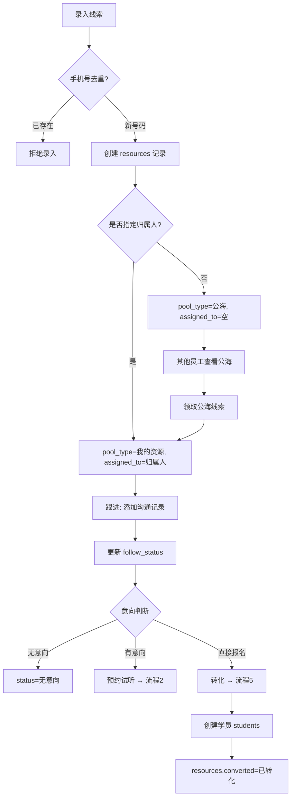

### 前置条件
- 渠道字典已配置

### 操作步骤
1. 选择渠道、输入姓名和电话
2. 系统查重 phone
3. 未重复则创建，填入意向等级
4. 分配给归属人或进入公海
5. 跟进过程添加 communication_records

### 状态变化
- resources.status: → 待跟进 → 已联系 / 无意向 / 试听预约 / 已报名
- resources.converted: 未转化 → 已转化

### 失败场景
- 手机号重复：拒绝创建
- 必填字段缺失：返回错误

### 权限
- 无细粒度权限控制（当前为遗留系统）

### 事务
- 单条 INSERT，无显式事务

---

## 流程 2: 试听预约→取消→到场→转化

### 流程图

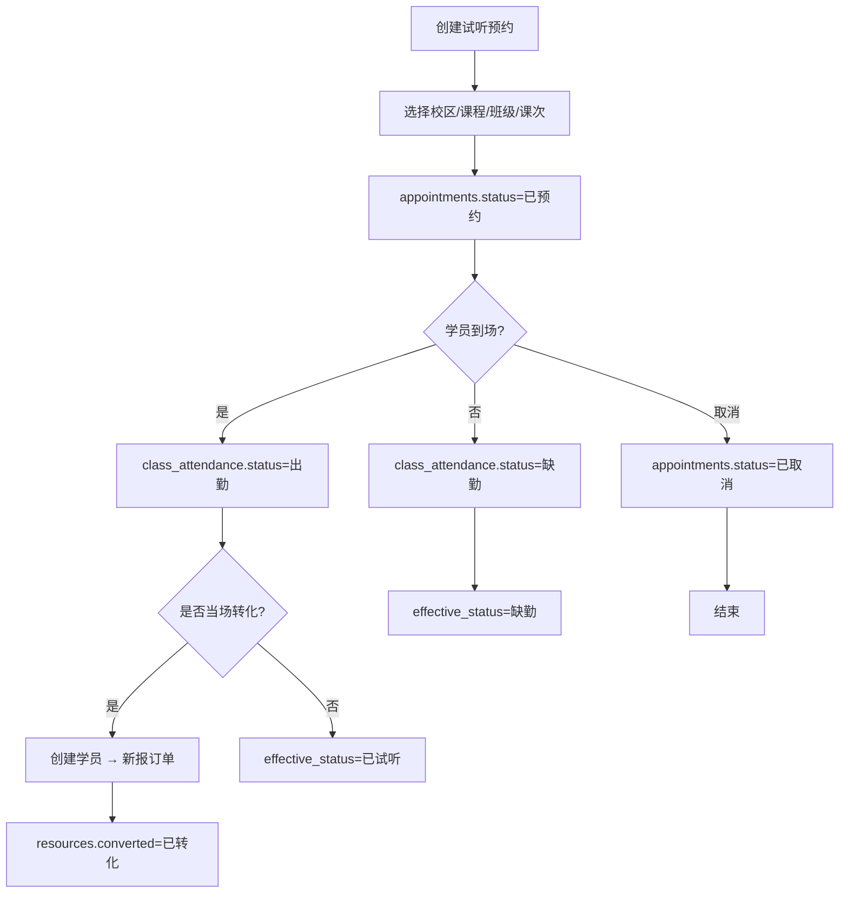

### 前置条件
- 线索已存在（resource_id）
- 课程和班级已配置

### 操作步骤
1. 填写预约信息（学员名/电话/课程/班级/课次）
2. 创建 appointments 记录
3. 试听当日：class_attendance 记录到场情况
4. 系统根据 class_attendance 动态计算 effective_status
5. 试听后可一键转化为学员+新报订单

### 状态变化
- appointments.status: 已预约 → （通过 class_attendance 计算的）已试听/缺勤/已取消
- resources.converted: 未转化→已转化（转化后）

### 失败场景
- 班级/课次不存在
- 已超出班级 max_students（待确认是否有校验）

### 权限
- 无权限校验

### 事务
- 单表操作，预约和考勤可能跨多个请求

---

## 流程 3: 学员建档和家庭关系

### 流程图

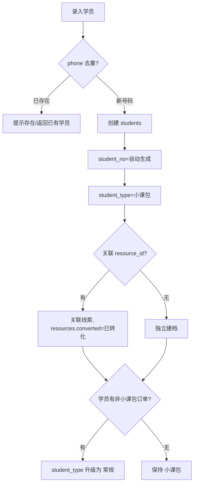

### 前置条件
- 手机号唯一

### 操作步骤
1. 录入姓名/电话
2. 自动生成学号
3. 默认 student_type=小课包
4. 关联来源线索（如有）
5. 后续有报名时自动升级类型

### 状态变化
- student_type: 小课包 → 常规（不可逆）

### 失败场景
- 手机号重复

### 家庭关系
- 代码中存在 family_member 相关逻辑，但具体实现待确认

---

## 流程 4: 课程报价方案配置

### 流程图

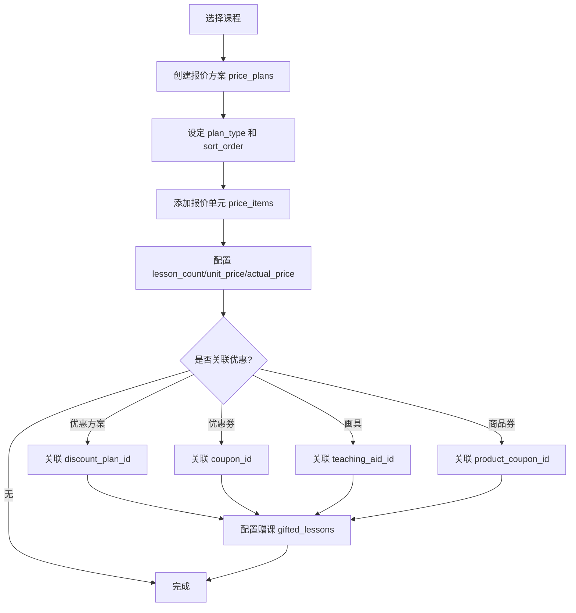

### 前置条件
- 课程已创建
- 优惠方案/券已配置（如关联）

### 操作步骤
1. 创建报价方案并绑定课程
2. 添加报价单元（name/lesson_count/unit_price/actual_price）
3. 可选关联优惠方案/优惠券/画具/赠课
4. actual_price 为面向客户的最终价格

### 状态变化
- 无状态字段，创建即生效

---

## 流程 5: 新报/续费/扩科/小课包/赠课下单

### 流程图

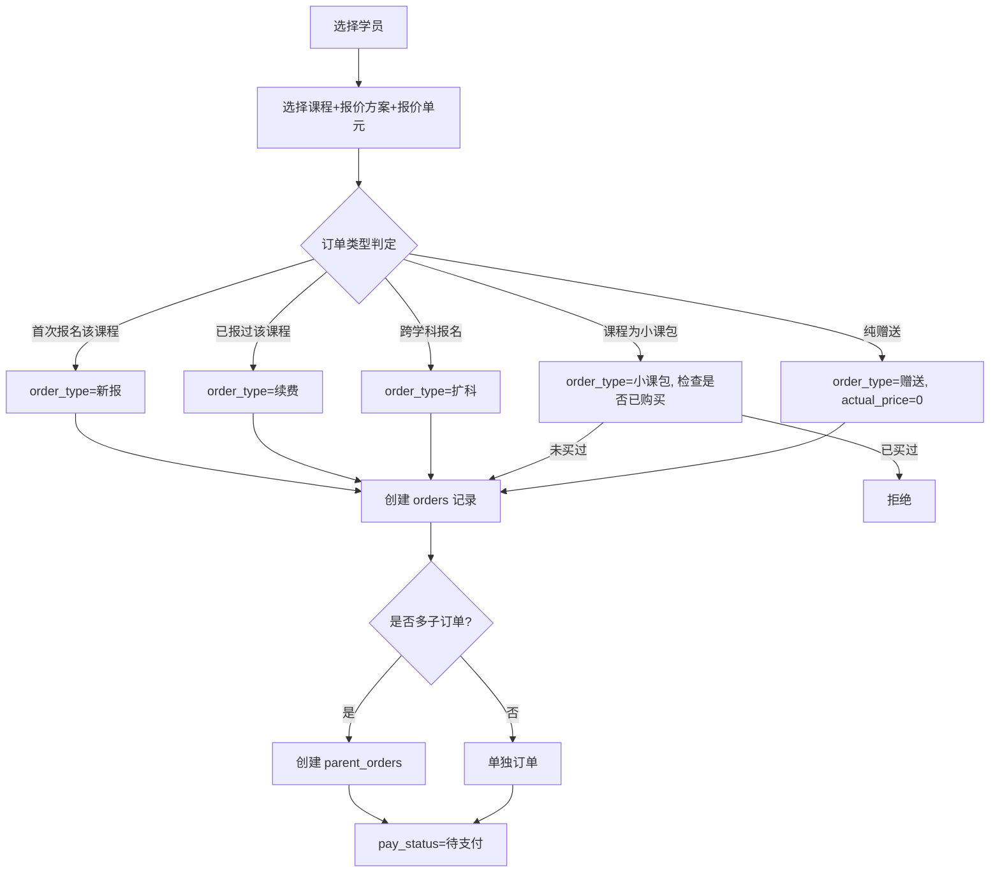

### 前置条件
- 学员已建档
- 课程+报价方案已配置

### 操作步骤
1. 选择学员和课程
2. 选择报价方案和报价单元
3. 系统判定订单类型
4. 快照优惠信息到 orders 表
5. 如有赠课，创建独立赠送订单
6. 生成订单号

### 状态变化
- orders.status: 已报名
- orders.pay_status: 待支付

### 失败场景
- 小课包重复购买
- 优惠方案过期
- 课程未关联校区

---

## 流程 6: 父子订单创建和支付分摊

### 流程图

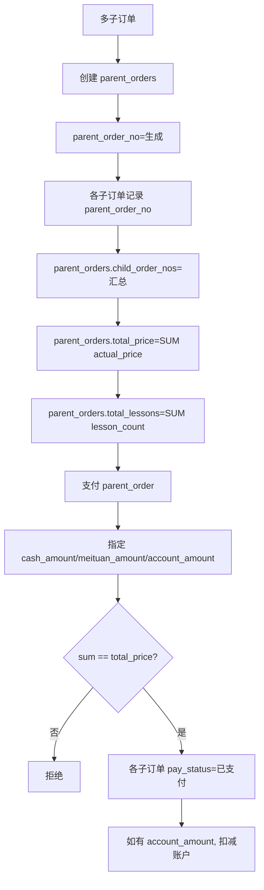

### 前置条件
- 至少 2 个子订单
- 支付金额与总价匹配

### 操作步骤
1. 创建父订单汇总
2. 每个子订单关联 parent_order_no
3. 支付时验证 sum(各渠道) = total_price
4. 一次性更新所有子订单

### 事务
- 需显式事务保证一致性（代码证据：index.php: BEGIN/COMMIT）

---

## 流程 7: 储值充值→余额支付→账户退款

### 流程图

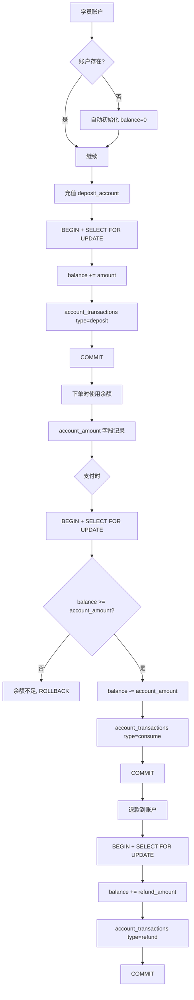

### 前置条件
- 学员已存在

### 操作步骤
1. 首次访问自动初始化账户
2. 充值使用 FOR UPDATE 行锁
3. 消费校验余额
4. 退款恢复余额
5. 所有操作记录流水

### 状态变化
- balance 实时变化
- account_transactions 追加

### 事务
- 所有资金操作使用显式事务 + FOR UPDATE

---

## 流程 8: 班级→分班→排课→临时学员

### 流程图

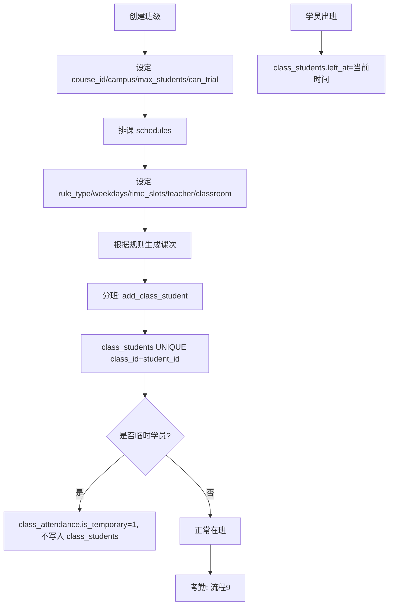

### 前置条件
- 课程已创建
- 教师已在 employees 中标记 is_teacher

### 操作步骤
1. 创建班级（绑定课程/校区）
2. 设置排课规则（按周几+时段自动生成）
3. 手动将学员分入班级
4. 临时学员不占班级名额，仅考勤时标记

### 失败场景
- 班级已满 max_students
- 学员已在同一班级

---

## 流程 9: 常规课程考勤和扣课

### 流程图

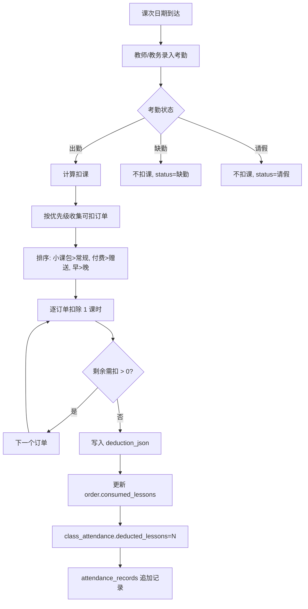

### 前置条件
- 学员在班
- 存在有效订单

### 操作步骤
1. 选择课次
2. 标记学员出勤状态
3. 出勤触发自动扣课
4. 按优先级从订单消耗
5. 扣课明细写入 deduction_json

### 状态变化
- class_attendance.status: 出勤/缺勤/请假
- orders.consumed_lessons: 递增

### 失败场景
- 可用课时不足：扣完所有可用课时，标记欠课

### 审计
- 修改/冲正记录在 deduction_json 变化中可追溯

---

## 流程 10: 活动报名→收费→扣课→考勤

### 流程图

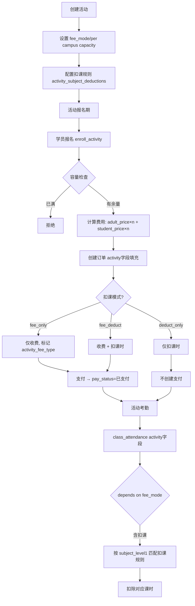

### 前置条件
- 活动在报名期内
- 校区容量未满

### 操作步骤
1. 创建活动配置 fee_mode 和扣课规则
2. 学员报名 → 按模式创建订单
3. 付费模式生成支付
4. 活动考勤执行扣课

---

## 流程 11: 课程退款→账户退款→转校退款

### 流程图

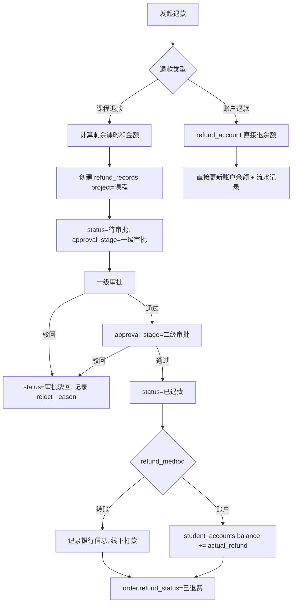

### 前置条件
- 订单存在且 refund_status=正常
- 剩余课时 > 0（课程退款）

### 操作步骤
1. 选择订单发起退款
2. 系统计算剩余课时/金额和 custom_deduction
3. 提交审批（二级）
4. 审批通过后按 refund_method 执行退款

### 审计
- refund_records 完整记录审批链

---

## 流程 12: 转校→订单作废→课时归还

### 流程图

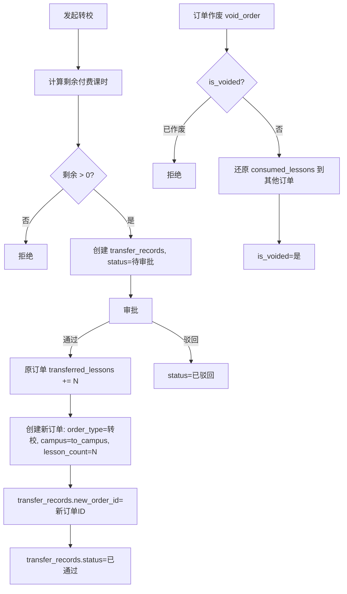

### 前置条件
- 订单未退费
- 有剩余课时

### 操作步骤
1. 选择订单和目标校区
2. 系统计算可转移课时
3. 审批通过后创建新订单
4. 原订单标记 transferred_lessons

---

## 流程 13: 教材/画具销售和退回

### 流程图

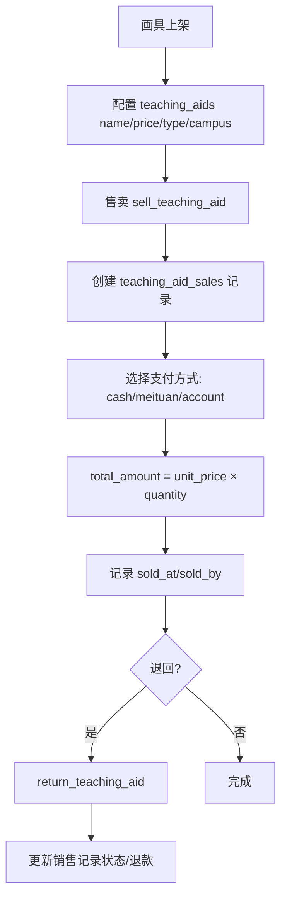

### 前置条件
- 画具已上架（status=上架）
- 学员已建档

### 操作步骤
1. 创建画具配置
2. 选择学员和画具
3. 支付（支持多渠道分摊）
4. 退回时更新记录

### 状态变化
- teaching_aid_sales 创建/退回标记

---

## 流程 14: 优惠方案→优惠券→发放→核销

### 流程图

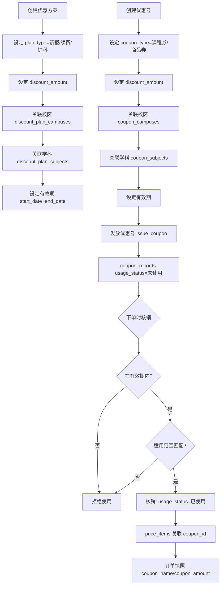

### 前置条件
- 校区和学科已配置

### 操作步骤
1. 创建优惠方案/券模板
2. 设定适用范围和有效期
3. 向学员发放优惠券
4. 下单时选择券 → 校验有效期和适用范围
5. 核销后写入订单快照

### 状态变化
- coupon_records.usage_status: 未使用 → 已使用 / 已过期

### 失败场景
- 过期
- 不适用当前校区/学科
- 优惠金额超过订单金额
