---
AIGC:
    Label: "1"
    ContentProducer: 001191440300708461136T1XGW3
    ProduceID: 3f11eb7fa23d664c4b1c1527387f20fd_15b154f180ff11f182875254006c9bbf
    ReservedCode1: 7V+qBoPJDhPQ6pIewTeYedy6cYILXQFY9qgcsX2KoCgdcosu+xr4WMmbMcdjomIZyPoD5dHjEVKRm+MB66HvQwIhrMOkaUiUyRQoy/O3f1NXDgjCgEeV+7sHp5NQUBKeSKrWtFNFuTXrb7xngCwgLRqKcxg32/0QqD++fqshKkO3cOglh6HR2MJjmd8=
    ContentPropagator: 001191440300708461136T1XGW3
    PropagateID: 3f11eb7fa23d664c4b1c1527387f20fd_15b154f180ff11f182875254006c9bbf
    ReservedCode2: 7V+qBoPJDhPQ6pIewTeYedy6cYILXQFY9qgcsX2KoCgdcosu+xr4WMmbMcdjomIZyPoD5dHjEVKRm+MB66HvQwIhrMOkaUiUyRQoy/O3f1NXDgjCgEeV+7sHp5NQUBKeSKrWtFNFuTXrb7xngCwgLRqKcxg32/0QqD++fqshKkO3cOglh6HR2MJjmd8=
---

# 04-state-machines.md — 状态机

> 版本：v1.0  
> 日期：2026-07-16  
> 格式：Mermaid stateDiagram-v2，标明合法转换、触发动作、操作角色、失败后状态、可撤销性、对其他数据的影响。

---

## 1. 线索 (resources) 状态机

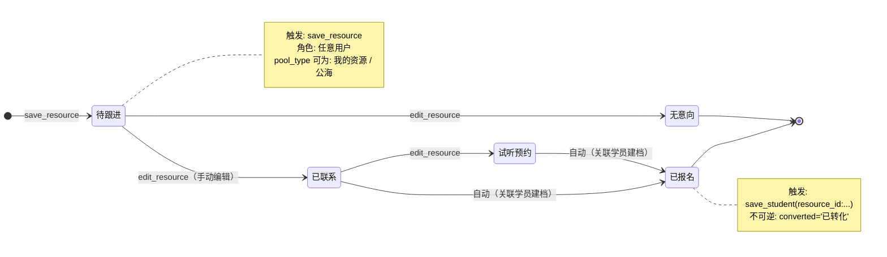

| 属性 | 说明 |
|------|------|
| 状态字段 | resources.status（手动编辑）、resources.pool_type（分配/领取）、resources.converted（自动） |
| 核心触发 | save_resource / edit_resource / assign_resource / claim_resource / save_student |
| 合法转换 | status: 待跟进 → 已联系 → 无意向 / 试听预约 → 已报名 |
| 失败后状态 | 无回滚机制 |
| 可撤销性 | 不可撤销（特别是 converted='已转化'） |
| 对其他数据影响 | converted='已转化' 影响学员列表筛选 |

---

## 2. 试听预约 (appointments) 状态机

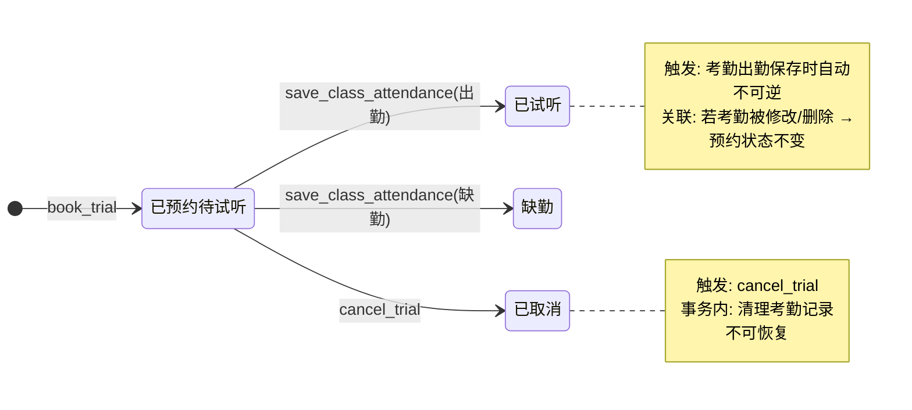

| 属性 | 说明 |
|------|------|
| 状态字段 | appointments.status |
| 核心触发 | book_trial / save_class_attendance / cancel_trial |
| 合法转换 | 已预约待试听 → 已试听 / 缺勤 / 已取消 |
| 失败后状态 | cancel_trial 事务回滚 → 保持原状态 |
| 可撤销性 | 已取消不可恢复 |
| 对其他数据影响 | cancel_trial 同步清理 class_attendance 记录 |

---

## 3. 订单 (orders) 状态机

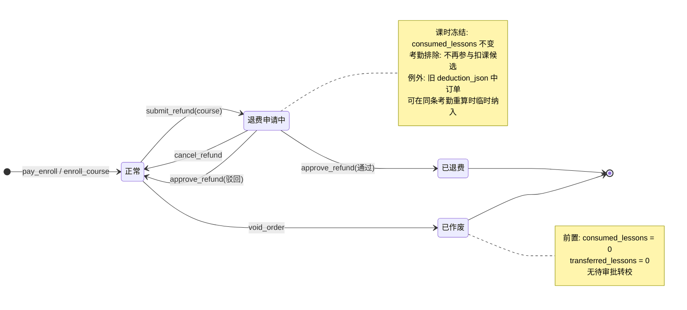

| 属性 | 说明 |
|------|------|
| 状态字段 | orders.is_voided, orders.refund_status |
| 核心触发 | pay_enroll / void_order / submit_refund / approve_refund / cancel_refund |
| 合法转换 | 正常 → 退费申请中 → 已退费 / 驳回→正常；正常 → 已作废 |
| 失败后状态 | void_order 校验失败 → 不变；退费冻结冲突 → rollback |
| 可撤销性 | 退费申请可撤销（cancel_refund）；已作废不可恢复；已退费不可恢复 |
| 对其他数据影响 | 退费申请中→考勤扣课排除；void_order→活动人数回滚；退费/作废→余额退还 |

---

## 4. 支付 (订单支付) 状态机

> 注：当前系统支付无独立状态机。支付在订单创建时同步完成（pay_enroll 内部）。无异步支付、无待支付状态。
> 仅课程退费审批流程存在状态，见下方「退款审批」状态机。

---

## 5. 订单作废 状态机

见「订单状态机」中 正常 → 已作废 的路径。

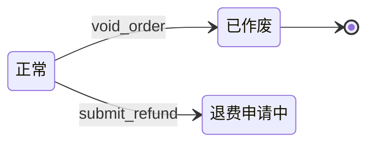

| 属性 | 说明 |
|------|------|
| 前置条件 | consumed_lessons=0, transferred_lessons=0, 无待审批转校 |
| 触发 | api/orders.php:voidOrder |
| 操作角色 | 任意用户（无权限校验） |
| 失败后状态 | 保持正常，前端提示拒绝原因 |
| 可撤销性 | 不可撤销 |
| 对其他数据影响 | 余额退回 → student_accounts.balance += account_amount；活动报名人数回滚 |

---

## 6. 退款审批 (refund_records) 状态机

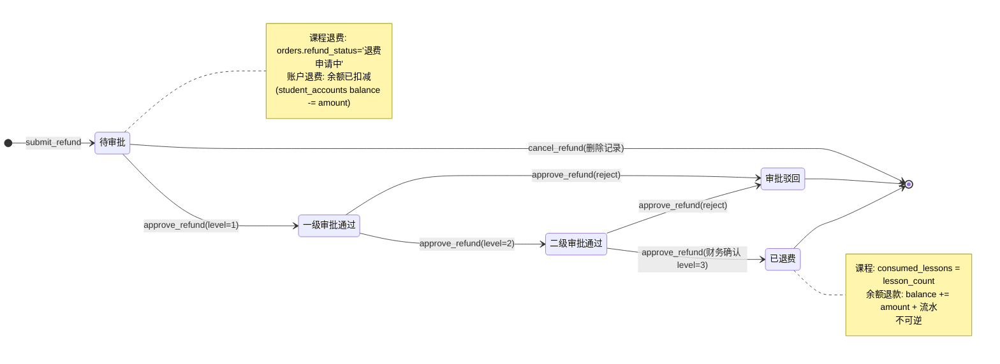

| 属性 | 说明 |
|------|------|
| 状态字段 | refund_records.status, orders.refund_status |
| 核心触发 | submit_refund / approve_refund / cancel_refund |
| 合法转换 | 待审批 → 一级 → 二级 → 已退费；任意步 → 审批驳回；待审批 → 删除(cancel) |
| 失败后状态 | 状态不合法时拒绝（已终止退费不可继续） |
| 可撤销性 | cancel_refund 可删除待审批记录；审批驳回后不可重新提交同一记录 |
| 对其他数据影响 | 退费 → orders.refund_status / consumed_lessons；账户退款 → student_accounts / account_transactions |

---

## 7. 转校审批 (transfer_records) 状态机

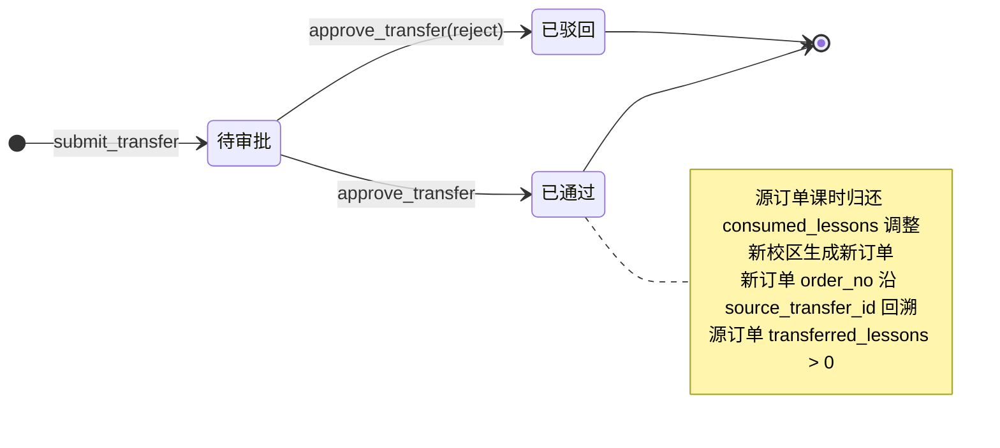

| 属性 | 说明 |
|------|------|
| 状态字段 | transfer_records.status |
| 核心触发 | submit_transfer / approve_transfer |
| 合法转换 | 待审批 → 已通过 / 已驳回 |
| 失败后状态 | 保持待审批 |
| 可撤销性 | 已通过不可撤销；已驳回不可恢复 |
| 对其他数据影响 | 源订单 consumed_lessons 归还 + transferred_lessons 标记；新校区生成新订单 |

---

## 8. 学员在册 (students) 状态机

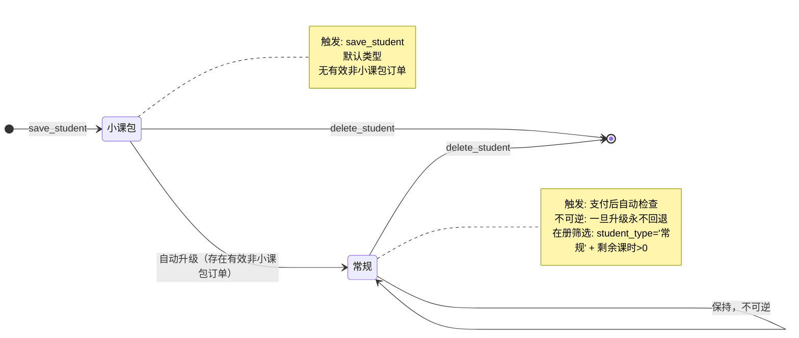

| 属性 | 说明 |
|------|------|
| 状态字段 | students.student_type |
| 核心触发 | save_student（初始化）/ pay_enroll / enroll_course（自动升级检测） |
| 合法转换 | 小课包 → 常规（单向不可逆） |
| 失败后状态 | 升级后不会因订单作废/退费而回退 |
| 可撤销性 | 不可逆 |
| 对其他数据影响 | student_type='常规' 影响在册学员筛选、分班候选 |

---

## 9. 班级学员 (class_students) 状态机

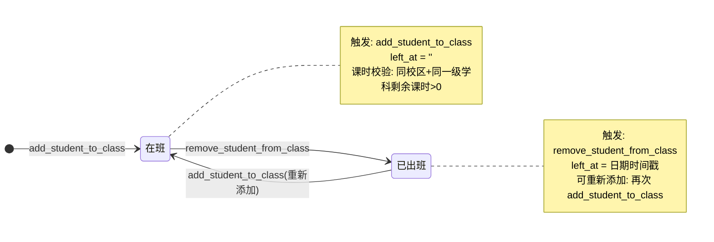

| 属性 | 说明 |
|------|------|
| 状态字段 | class_students.left_at |
| 核心触发 | add_student_to_class / remove_student_from_class |
| 合法转换 | 在班 ↔ 已出班（可逆） |
| 失败后状态 | 课时不足 → 拒绝分班 |
| 可撤销性 | 出班可逆（重新添加） |
| 对其他数据影响 | 班级学员数；课表考勤候选 |

---

## 10. 考勤 (class_attendance) 状态机

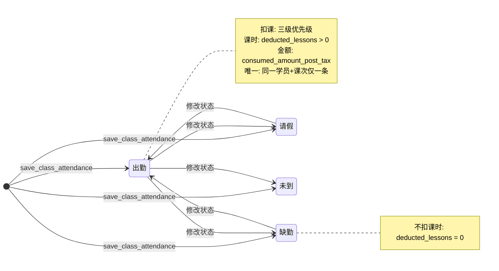

| 属性 | 说明 |
|------|------|
| 状态字段 | class_attendance.status |
| 核心触发 | save_class_attendance / updateAttendance |
| 合法转换 | 出勤 ↔ 缺勤 / 请假 / 未到（可逆）；修改时先还课时再重新扣 |
| 失败后状态 | 编辑保存时课时不足 → rollback + 提示；退费冲突 → 拒绝修改状态 + 扣课时数 |
| 可撤销性 | 修改可逆（还旧课时 + 重新扣）；但旧 deduction_json 涉及已退费订单时不可改状态/扣课 |
| 对其他数据影响 | 出勤 → orders.consumed_lessons += N；改缺勤 → orders.consumed_lessons -= N |

---

## 11. 活动 (activities) 状态机

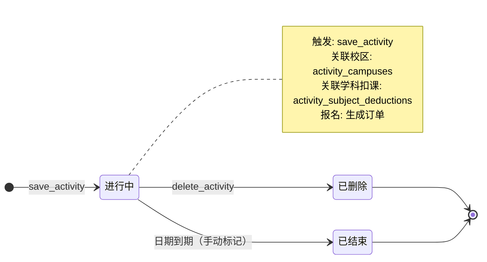

| 属性 | 说明 |
|------|------|
| 状态字段 | 无独立状态字段（通过 start_date/end_date 判断） |
| 核心触发 | save_activity / delete_activity |
| 合法转换 | 进行中 → 已结束（自然到期）/ 删除 |
| 失败后状态 | 无 |
| 可撤销性 | 删除不可恢复 |
| 对其他数据影响 | 活动报名订单、活动考勤记录 |

---

## 12. 优惠券 (coupons) 状态机

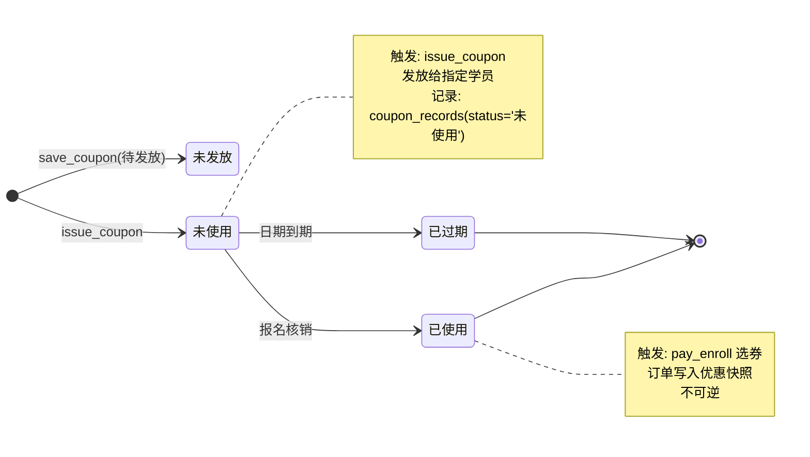

| 属性 | 说明 |
|------|------|
| 状态字段 | coupon_records.status |
| 核心触发 | issue_coupon / pay_enroll（核销） |
| 合法转换 | 未使用 → 已使用 / 已过期 |
| 失败后状态 | 无 |
| 可撤销性 | 已使用不可逆 |
| 对其他数据影响 | 订单金额扣减（actual_price -= coupon_amount） |

---

## 通用风险标注

| 风险 | 涉及状态机 | 说明 |
|------|----------|------|
| 状态字段无 Enum 约束 | 全部 | 所有状态字段为 VARCHAR(500)，依赖代码而非数据库约束 |
| 状态恢复无完整事务 | 订单/退费 | 多表状态联动更新可能部分失败 |
| 无操作人记录 | 全部 | 状态变更无 created_by/updated_by 审计 |
| 状态与数据可能不一致 | 考勤/订单 | deduction_json vs consumed_lessons 无强一致性校验 |
*（内容由AI生成，仅供参考）*
